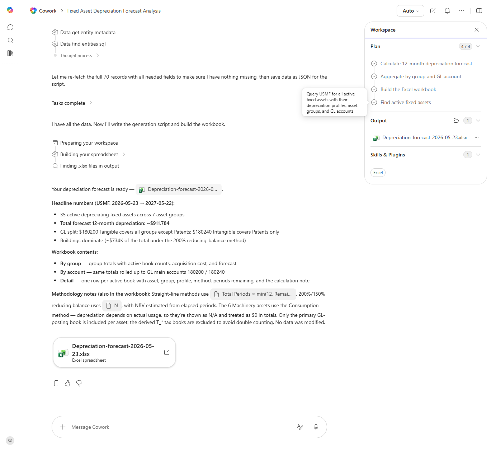

# Depreciation Forecast (12 months)

Forecasts the next 12 months of depreciation expense by asset group and by GL account.

> ℹ **Tenant data caveat.** Validated end-to-end against a live Cowork tenant on 2026-05-23 with USMF (forecast window 2026-05-23 to 2027-05-22). Cowork ran all four plan steps and produced 'Depreciation-forecast-2026-05-23.xlsx' with three sheets (By group, By account, Detail). Headline numbers: 35 active depreciating fixed assets across 7 asset groups, total 12-month forecast ~$911,784 (Buildings dominate at ~$734K under 200% reducing-balance). GL split: $180200 Tangible covers all groups except Patents; $180240 Intangible covers Patents. 6 Machinery assets use the Consumption method and were correctly shown as N/A in totals (depreciation depends on actual usage). No data was modified.

## Business value

Gives FP&A a defensible, asset-by-asset depreciation forecast for the budget instead of the historical-average shortcut.

## What it does

A 12-month forward look at depreciation expense.

## Prerequisites

- Dynamics 365 F&SCM access with the Fixed assets role

## Step-by-step

1. Paste the prompt.
2. Share the workbook with FP&A.

## Expected output

Workbook with three sheets.

## Skills used

OOTB: Excel
Plugin actions: dynamics-365-erp/data_find_entity_type, dynamics-365-erp/data_find_entities_sql

## License

CC-BY-4.0 — see repo `LICENSE`.
