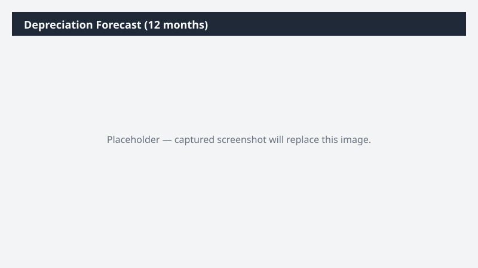

# Depreciation Forecast (12 months)

Forecasts the next 12 months of depreciation expense by asset group and by GL account.

> ⚠ **Draft recipe — not yet verified.** The prompt, OOTB skill list, and plugin actions named below are starter content. No one has run this against a live Cowork tenant with the Dynamics 365 ERP plugin yet. Validate before relying on it.

## Business value

Gives FP&A a defensible, asset-by-asset depreciation forecast for the budget instead of the historical-average shortcut.

## What it does

A 12-month forward look at depreciation expense.

## Prerequisites

- Dynamics 365 F&SCM access with the Fixed assets role

## Step-by-step

1. Paste the prompt.
2. Share the workbook with FP&A.

## Expected output

Workbook with three sheets.

## Skills used

OOTB: Excel
Plugin actions: dynamics-365-erp/data_find_entity_type, dynamics-365-erp/data_find_entities_sql

## License

CC-BY-4.0 — see repo `LICENSE`.
