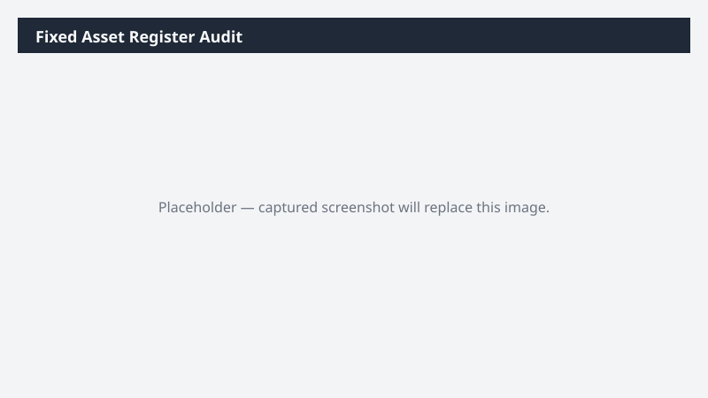

# Fixed Asset Register Audit

Audits the fixed asset register for missing fields, inconsistent depreciation profiles, and assets due for retirement.

> ⚠ **Draft recipe — not yet verified.** The prompt, OOTB skill list, and plugin actions named below are starter content. No one has run this against a live Cowork tenant with the Dynamics 365 ERP plugin yet. Plugin action ids may not match Microsoft's actual published surface. Validate before relying on it.

## What it does

Surfaces fixed-asset data quality issues.

## Prerequisites

- Dynamics 365 F&SCM access with the Fixed assets role

## Step-by-step

1. Paste the prompt.
2. Update flagged records in D365 with the asset owner.

## Expected output

Workbook of fixed-asset register findings.

## Skills used

OOTB: Excel
Plugin actions: dynamics-365-erp/fixed-asset-query

## License

CC-BY-4.0 — see repo `LICENSE`.
