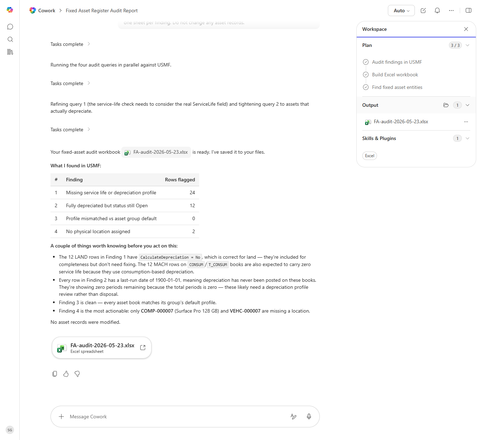

# Fixed Asset Register Audit

Audits the fixed asset register for missing fields, inconsistent depreciation profiles, and assets due for retirement.

> ℹ **Tenant data caveat.** Validated end-to-end against a live Cowork tenant on 2026-05-23 with USMF. Cowork ran all four audit queries in parallel and produced 'FA-audit-2026-05-23.xlsx' with: 24 assets missing service life or depreciation profile, 12 fully-depreciated-but-still-Open, 0 profile mismatches, 2 missing physical location (COMP-000007, VEHC-000007). Cowork added valuable context-aware commentary - 12 LAND rows correctly carry CalculateDepreciation=No (not a bug), and 12 MACH rows on CONSUM/T_CONSUM books are expected to have zero service life because they use consumption-based depreciation. No asset records were modified.

## Business value

Cleans up the asset register so depreciation, insurance, and property-tax reporting are all based on accurate data - not stale records.

## What it does

Surfaces fixed-asset data quality issues.

## Prerequisites

- Dynamics 365 F&SCM access with the Fixed assets role

## Step-by-step

1. Paste the prompt.
2. Update flagged records in D365 with the asset owner.

## Expected output

Workbook of fixed-asset register findings.

## Skills used

OOTB: Excel
Plugin actions: dynamics-365-erp/data_find_entity_type, dynamics-365-erp/data_find_entities_sql

## License

CC-BY-4.0 — see repo `LICENSE`.
