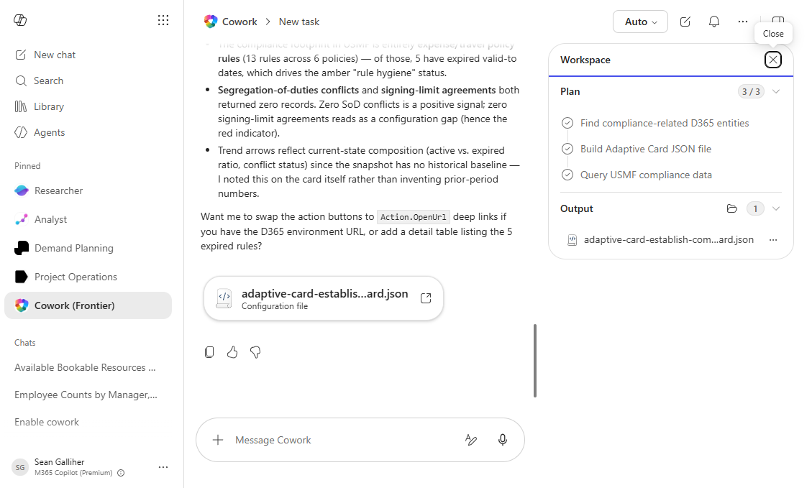

# Establish compliance policies and procedures Status Adaptive Card

Produces a reusable Adaptive Card JSON snapshot of establish compliance policies and procedures status for embedding in dashboards, emails, or Teams.

## Business value

Gives any consuming app (Teams, Outlook, custom dashboard) a single canonical establish compliance policies and procedures status card so different surfaces always show the same numbers.

## What it does

Generates an Adaptive Card JSON file with current establish compliance policies and procedures KPIs and RAG indicators.

## Prerequisites

- Dynamics 365 F&SCM access with the appropriate role
- Cowork D365 ERP plugin enabled

## Step-by-step

1. Open Cowork and confirm the Dynamics 365 ERP plugin is toggled on for your session.
2. Paste the prompt from `prompt.md` into a new task.
3. Review the generated output and adjust scope as needed.

## Expected output

See the prompt for the specific deliverable(s). All generated files land in `Documents/Cowork/output/` in OneDrive.

## Skills used

OOTB: Adaptive Cards
Plugin actions: dynamics-365-erp/data_find_entity_type, dynamics-365-erp/data_find_entities_sql

## License

CC-BY-4.0 — see repo `LICENSE`.
