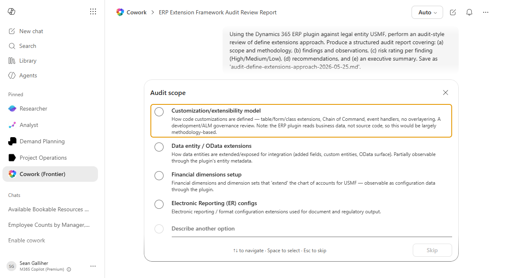

# Define extensions approach Completeness Audit

Audits define extensions approach records for completeness and policy compliance against rule-based checks.

## Business value

Reduces audit findings and prevents downstream errors by surfacing missing fields, stale records, and out-of-policy entries while there is still time to fix them at the source.

## What it does

Reads define extensions approach records, runs a rule-based completeness audit, and emits an exceptions workbook.

## Prerequisites

- Dynamics 365 F&SCM access with the appropriate role
- Cowork D365 ERP plugin enabled

## Step-by-step

1. Open Cowork and confirm the Dynamics 365 ERP plugin is toggled on for your session.
2. Paste the prompt from `prompt.md` into a new task.
3. Review the generated output and adjust scope as needed.

## Expected output

See the prompt for the specific deliverable(s). All generated files land in `Documents/Cowork/output/` in OneDrive.

## Skills used

OOTB: Excel
Plugin actions: dynamics-365-erp/data_find_entity_type, dynamics-365-erp/data_find_entities_sql

## License

CC-BY-4.0 — see repo `LICENSE`.
