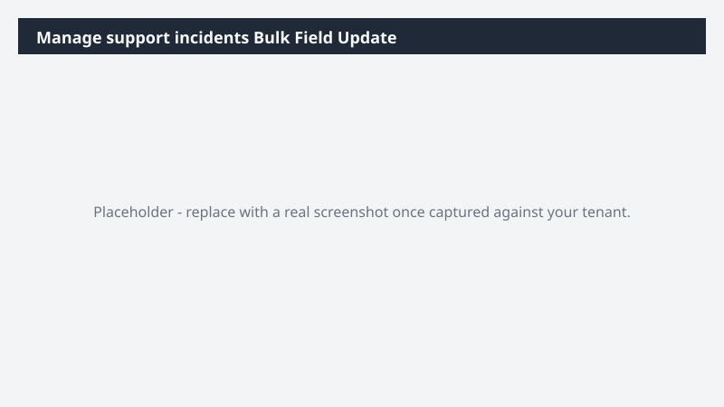

# Manage support incidents Bulk Field Update

Applies a bulk field update across manage support incidents records from an input list, with dry-run preview before commit.

> ⚠ **Draft recipe — not yet verified.** Generated by the bulk catalog generator to ensure every Business Process Catalog process has at least one recipe. The prompt below uses the real D365 ERP MCP tool surface and the USMF tenant data conventions, but no one has run this against a live Cowork tenant yet. Validate before relying on it.

> ⚠ **This recipe modifies Dynamics 365 data.** Run it in a sandbox tenant first and review the proposed changes before approving any write action.

## Business value

Avoids the click-by-click drudgery (and risk of inconsistency) when manage support incidents records need a coordinated change - and the dry-run preview catches mistakes before they hit the system.

## What it does

Reads target record IDs + desired field values, previews changes, then applies them after explicit approval.

## Prerequisites

- Dynamics 365 F&SCM access with the appropriate role
- Cowork D365 ERP plugin enabled

## Step-by-step

1. Open Cowork and confirm the Dynamics 365 ERP plugin is toggled on for your session.
2. Paste the prompt from `prompt.md` into a new task.
3. Review the generated output and adjust scope as needed.
4. **Before approving any write action, review the dry-run preview.**

## Expected output

See the prompt for the specific deliverable(s). All generated files land in `Documents/Cowork/output/` in OneDrive.

## Skills used

OOTB: Excel
Plugin actions: dynamics-365-erp/data_find_entity_type, dynamics-365-erp/data_update_entities

## License

CC-BY-4.0 — see repo `LICENSE`.
