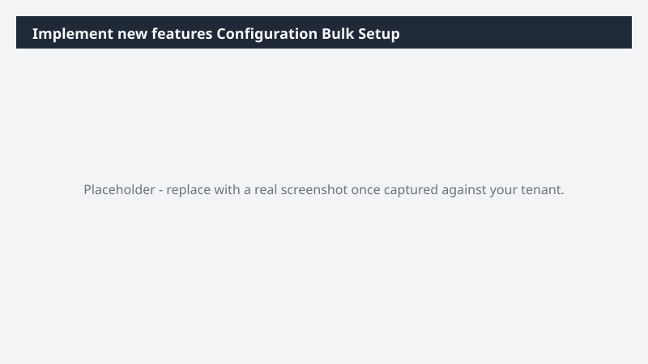

# Implement new features Configuration Bulk Setup

Applies a bulk configuration change to implement new features from an input Excel file, with validation and rollback support.

> ⚠ **Draft recipe — not yet verified.** Generated by the bulk catalog generator to ensure every Business Process Catalog process has at least one recipe. The prompt below uses the real D365 ERP MCP tool surface and the USMF tenant data conventions, but no one has run this against a live Cowork tenant yet. Validate before relying on it.

> ⚠ **This recipe modifies Dynamics 365 data.** Run it in a sandbox tenant first and review the proposed changes before approving any write action.

## Business value

Eliminates the click-by-click burden of bulk configuration changes for implement new features, cutting setup time from days to minutes while preserving auditability.

## What it does

Reads a configuration Excel file, validates each row, then applies updates via the D365 ERP plugin.

## Prerequisites

- Dynamics 365 F&SCM access with the appropriate role
- Cowork D365 ERP plugin enabled

## Step-by-step

1. Open Cowork and confirm the Dynamics 365 ERP plugin is toggled on for your session.
2. Paste the prompt from `prompt.md` into a new task.
3. Review the generated output and adjust scope as needed.
4. **Before approving any write action, review the dry-run preview.**

## Expected output

See the prompt for the specific deliverable(s). All generated files land in `Documents/Cowork/output/` in OneDrive.

## Skills used

OOTB: Excel
Plugin actions: dynamics-365-erp/data_find_entity_type, dynamics-365-erp/data_update_entities, dynamics-365-erp/form_open_menu_item, dynamics-365-erp/form_set_control_values, dynamics-365-erp/form_save_form

## License

CC-BY-4.0 — see repo `LICENSE`.
