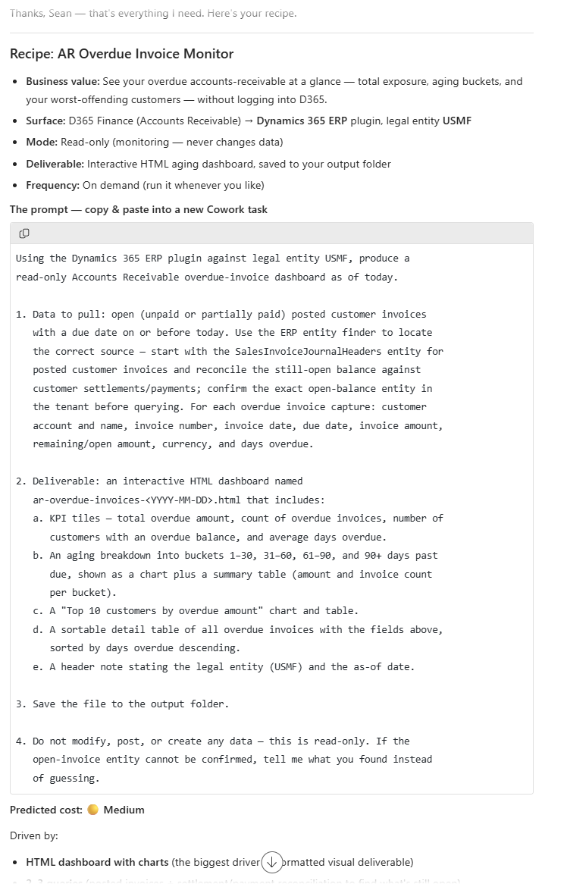

# D365 Recipe Planner

A guided planning skill that turns "I want to automate something in Dynamics 365" into a runnable Copilot Cowork prompt, plus a predicted cost tier explaining what drives the estimate.

## Business value

Lowers the barrier to authoring Cowork automations. A short interview replaces trial-and-error prompt writing, the generated prompt names the correct plugin and scope anchor for the chosen app, and the cost tier tells you what a run commits you to before you make it.

## What it does

Runs a short discovery interview across seven points — business outcome, process, D365 app, deliverable format, read-only versus write-back, data scope, and frequency — then:

1. Maps the chosen app to the correct Cowork plugin and scope anchor. Finance and ERP/Supply Chain are the same product (F&SCM) and share the `dynamics-365-erp` surface with a **legal entity** scope; Sales is a separate product on Dataverse scoped by **environment**.
2. Drafts a single copy-paste prompt with an explicit scope line, the data to pull, lettered deliverable requirements, an output location, and guardrails appropriate to read-only versus write-back.
3. Scores the plan against a seven-factor rubric and reports a low / medium / high cost tier **with the factors that drove it**, plus one suggestion for moving it down a tier.
4. Optionally saves the result as a Cookbook-format recipe markdown file.

It plans and drafts only. Its own guardrails forbid pulling, modifying, or creating records — the single live call it permits is a read-only schema lookup to confirm an entity exists.

## Prerequisites

- Copilot Cowork access
- Install the `d365-recipe-planner` skill — either publish it as a Cowork plugin and turn it on under **+ > Customize**, or drop the skill folder at `Documents/Cowork/skills/d365-recipe-planner/` in your OneDrive
- **No Dynamics 365 plugin is required.** The planner writes prompts; it does not query D365
- Optional: enable a Dynamics 365 Sales or ERP plugin if you want the planner to confirm entity names against your tenant before finalizing a prompt

## Step-by-step

1. Install the skill by whichever route you prefer — publish it as a Cowork plugin, or unzip the package below into `Documents/Cowork/skills/` so the folder lands at `Documents/Cowork/skills/d365-recipe-planner/`.
2. Start a new Cowork task. If you installed it as a plugin, turn it on under **+ > Customize**. If you installed it as a skill folder, Cowork discovers it automatically at the start of each conversation — there is no registration step.
3. Paste the prompt from `prompt.md`, or simply describe what you want to automate; the skill's description makes it self-invoking on phrases like "plan a recipe" or "help me automate a D365 task".
4. Answer the discovery questions. If you already have a rich brief, give it up front and the skill will skip ahead.
5. Copy the generated prompt into a **fresh** task to actually run it. The planner deliberately will not execute it for you.

## Expected output

A conversational recipe summary, a fenced copy-paste prompt, and a cost tier naming the two to four factors that drove the score. On request, a Cookbook-format `.md` recipe file saved to your Cowork output folder.

The capture below is a real run. From the brief "keep an eye on overdue customer invoices", the skill produced an **AR Overdue Invoice Monitor** recipe: it identified the surface as D365 Finance via the `dynamics-365-erp` plugin scoped to legal entity USMF, set the mode to read-only, drafted a four-part prompt with lettered deliverable requirements for an interactive HTML aging dashboard, and scored the plan **Medium** — naming the HTML-with-charts deliverable as the largest cost driver.

Note how the drafted prompt tells Cowork to *confirm the exact open-balance entity in the tenant before querying* and to *say what it found instead of guessing* if that entity cannot be confirmed. That is the skill's no-fabrication guardrail reaching into the prompts it writes.

## Skills used

OOTB: —

Plugin actions: none required. The planner is plugin-agnostic by design — it names the correct D365 plugin *in the prompt it generates* rather than calling one itself. If you enable a D365 plugin, it may optionally use a single read-only schema lookup to confirm an entity name before finalizing a prompt.

Custom: `d365-recipe-planner` — this is the installable artifact. The catalog records it here rather than in the `plugin` field, which is reserved for the Dynamics 365 data plugins a recipe depends on.

## License

CC-BY-4.0 — see repo `LICENSE`.
