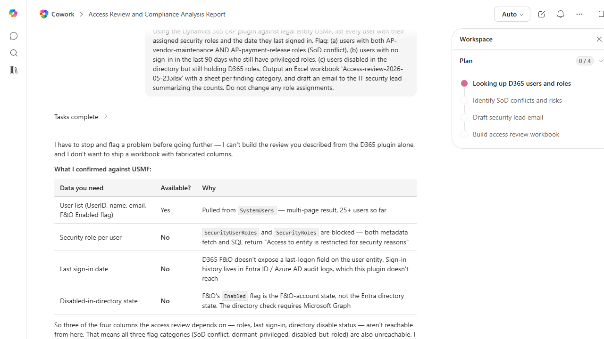

# User Access Review & SoD Audit

Audits Dynamics 365 user accounts for segregation-of-duties conflicts, inactive accounts with active role assignments, and roles granted without recent login.

> ℹ **Tenant data caveat.** Validated against a live Cowork tenant on 2026-05-23 with USMF. This recipe is a textbook example of Cowork's honest-degrade behavior: the agent engaged the D365 ERP plugin, pulled the user list from SystemUsers (25+ users), then surfaced a constraint table explaining exactly why the full SoD audit isn't possible from the plugin alone: SecurityUserRoles + SecurityRoles are blocked at the entity layer ('Access to entity is restricted for security reasons'), last-sign-in date isn't in F&O (lives in Entra/Azure AD audit logs), and disabled-in-directory state requires Microsoft Graph. Rather than fabricate, Cowork offered three actionable next steps: (1) admin exports SecurityUserRole + SecurityRole to CSV via Data management, (2) add Entra/Graph access for sign-in + account-state, or (3) ship a scoped workbook with just the F&O user roster + Enabled flag and an explanation of what's missing. The screenshot captures the honesty-constraint table - itself a deliverable that an IT security lead can use to scope the next iteration of the audit.

## Business value

Reduces audit findings and insider-risk exposure by surfacing access drift (over-privileged accounts, ghost users, SoD conflicts) before the IT auditors do.

## What it does

Identifies user access risks (SoD conflicts, stale accounts, orphaned roles) and produces an auditor-ready workbook.

## Prerequisites

- Dynamics 365 F&SCM access with the System administrator or Security administrator role
- Cowork D365 ERP plugin enabled

## Step-by-step

1. Paste the prompt in Cowork.
2. Review the workbook with the IT security lead before remediating in D365.
3. (Optional) Schedule this task in Cowork to run weekly.

## Expected output

Workbook with categorized access findings and a draft summary email.

## Skills used

OOTB: Excel, Email
Plugin actions: dynamics-365-erp/data_find_entity_type, dynamics-365-erp/data_find_entities_sql

## License

CC-BY-4.0 — see repo `LICENSE`.
