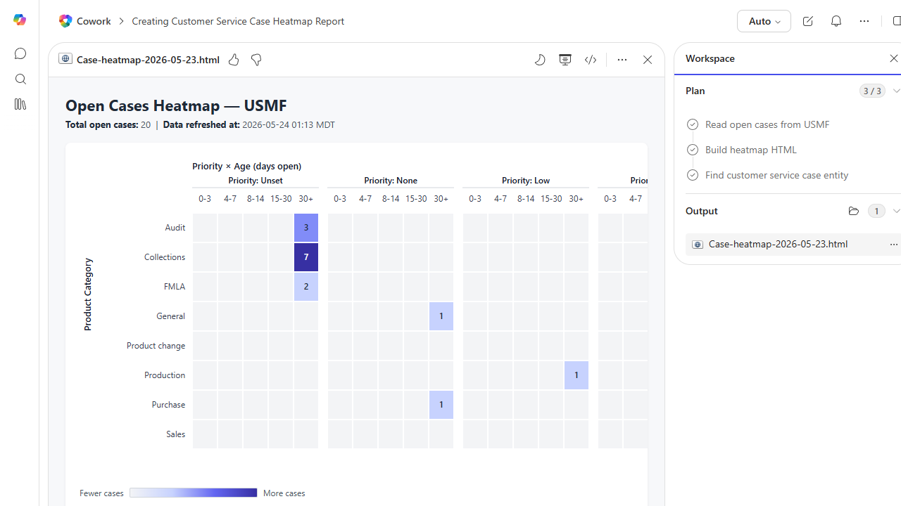

# Customer Service Case Heatmap (HTML)

Builds an interactive HTML heatmap of customer service cases by product category × priority × age bucket, with drill-through tooltips.

> ℹ **Tenant data caveat.** Validated end-to-end against a live Cowork tenant on 2026-05-23 with USMF. Cowork pulled 20 open cases from USMF Case Management (the F&O module - not a dedicated CRM Customer Service module - which surfaces generic cases across Audit, Collections, FMLA, General, Product change, Production, Purchase, Sales). All cases were opened 2016-2018 so every one lands in the 30+ days age bucket. Real HTML produced: Case-heatmap-2026-05-23.html (9.9 KB) with an SVG heatmap (Priority × Age on X, Product Category on Y) and per-cell tooltips. Largest cell: Collections / Unset priority / 30+ days = 7 cases. Audit / Unset / 30+ = 3 cases. Product change / Normal / 30+ = 2 cases.

## Business value

Gives service-ops leadership a one-click view of where backlog is concentrated so staffing and SLA effort can be retargeted on the products that are actually causing pain.

## What it does

Builds a self-contained HTML heatmap of open cases — opens in any browser, no D365 access needed by the viewer.

## Prerequisites

- Dynamics 365 access with read on Customer Service cases
- Cowork D365 ERP plugin enabled

## Step-by-step

1. Paste the prompt in Cowork.
2. Open the saved HTML in your browser and share via Teams or email.

## Expected output

One standalone interactive HTML heatmap file.

## Skills used

OOTB: PDF
Plugin actions: dynamics-365-erp/data_find_entity_type, dynamics-365-erp/data_find_entities_sql

## License

CC-BY-4.0 — see repo `LICENSE`.
