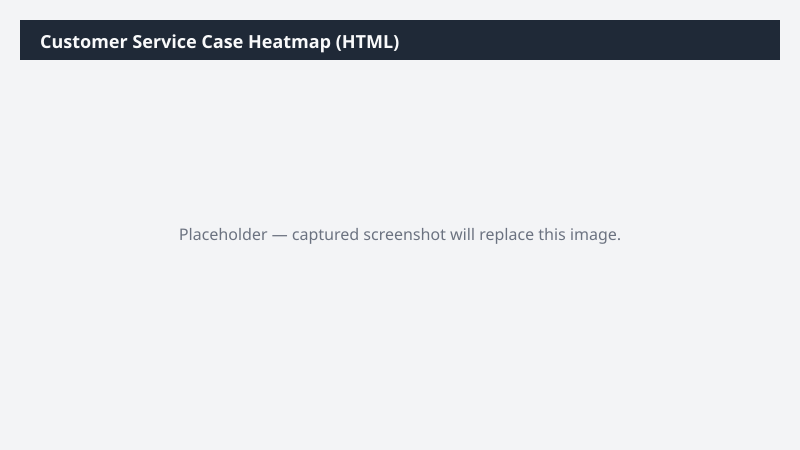

# Customer Service Case Heatmap (HTML)

Builds an interactive HTML heatmap of customer service cases by product category × priority × age bucket, with drill-through tooltips.

> ⚠ **Draft recipe — not yet verified.** The prompt, OOTB skill list, and plugin actions named below are starter content. No one has run this against a live Cowork tenant with the Dynamics 365 ERP plugin yet. Validate before relying on it.

## Business value

Gives service-ops leadership a one-click view of where backlog is concentrated so staffing and SLA effort can be retargeted on the products that are actually causing pain.

## What it does

Builds a self-contained HTML heatmap of open cases — opens in any browser, no D365 access needed by the viewer.

## Prerequisites

- Dynamics 365 access with read on Customer Service cases
- Cowork D365 ERP plugin enabled

## Step-by-step

1. Paste the prompt in Cowork.
2. Open the saved HTML in your browser and share via Teams or email.

## Expected output

One standalone interactive HTML heatmap file.

## Skills used

OOTB: PDF
Plugin actions: dynamics-365-erp/data_find_entity_type, dynamics-365-erp/data_find_entities_sql

## License

CC-BY-4.0 — see repo `LICENSE`.
