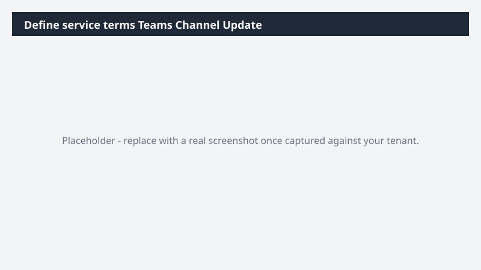

# Define service terms Teams Channel Update

Drafts a Teams channel post on define service terms status with an interactive Adaptive Card for quick triage.

> ⚠ **Draft recipe — not yet verified.** Generated by the bulk catalog generator to ensure every Business Process Catalog process has at least one recipe. The prompt below uses the real D365 ERP MCP tool surface and the USMF tenant data conventions, but no one has run this against a live Cowork tenant yet. Validate before relying on it.

## Business value

Replaces 'check the spreadsheet' Teams pings with a glanceable card the team can act on directly - reducing back-and-forth and decision latency.

## What it does

Reads define service terms, produces a Communications-ready Teams post + an Adaptive Card with quick-action buttons.

## Prerequisites

- Dynamics 365 F&SCM access with the appropriate role
- Cowork D365 ERP plugin enabled

## Step-by-step

1. Open Cowork and confirm the Dynamics 365 ERP plugin is toggled on for your session.
2. Paste the prompt from `prompt.md` into a new task.
3. Review the generated output and adjust scope as needed.

## Expected output

See the prompt for the specific deliverable(s). All generated files land in `Documents/Cowork/output/` in OneDrive.

## Skills used

OOTB: Communications, Adaptive Cards
Plugin actions: dynamics-365-erp/data_find_entity_type, dynamics-365-erp/data_find_entities_sql

## License

CC-BY-4.0 — see repo `LICENSE`.
