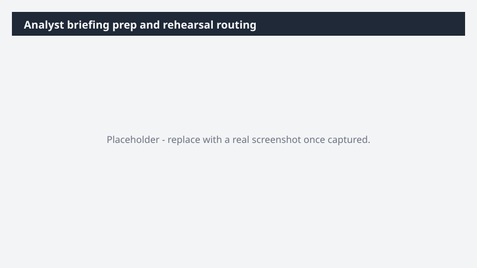

# Analyst briefing prep and rehearsal routing

Prep the [Analyst Firm] briefing package and get the team rehearsed before the room.

> ⚠ **Draft recipe — not yet verified.** This prompt is reproduced from the Microsoft Copilot Cowork Task Pack for Marketing. It has not been run against our tenant, so the output described below is the pack's stated expectation rather than an observed result. Validate before relying on it.

## Business value

Prep the [Analyst Firm] briefing package and get the team rehearsed before the room. An interactive HTML briefing dashboard - positioning, top three messages, anticipated Q&A, speaker notes - and a rehearsal locked on the calendar 48 hours out with the dashboard attached on approval.

## What it does

An interactive HTML briefing dashboard - positioning, top three messages, anticipated Q&A, speaker notes - and a rehearsal locked on the calendar 48 hours out with the dashboard attached on approval.

## Prerequisites

- Microsoft 365 Copilot licence with access to Cowork

## Step-by-step

1. Open Cowork and start a new task.
2. Paste the prompt from `prompt.md`, replacing anything in square brackets with your own values.
3. Review the plan Cowork proposes before letting it run.
4. Check any drafted email or calendar change before approving it — the prompt holds them for review rather than sending.

## How Cowork works through it

1. Email + meetings (prior) → Read our history with the firm
2. Web → Pull recent analyst coverage
3. OneDrive [Folder] → Read product materials
4. Messaging doc → Ground positioning in the approved standard
5. Brief → Positioning · Q&A · speaker notes
6. Build → Interactive HTML dashboard
7. Calendar → Lock the rehearsal 48 hours out

## Expected output

An interactive HTML briefing dashboard - positioning, top three messages, anticipated Q&A, speaker notes - and a rehearsal locked on the calendar 48 hours out with the dashboard attached on approval.

## Source

Adapted from the **Microsoft Copilot Cowork Task Pack for Marketing**, a task pack Microsoft publishes for customers. The prompt is reproduced as published; the surrounding recipe metadata, process tagging, and guidance are the Cookbook's.

## Skills used

OOTB: Email, Calendar Management, Meetings

Plugin: none required

## License

CC-BY-4.0 — see repo `LICENSE`.
