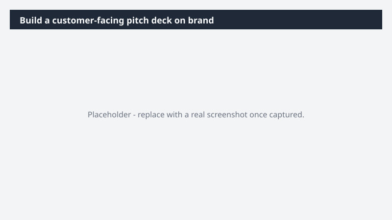

# Build a customer-facing pitch deck on brand

Hand the field a customer-facing pitch deck that's on-brand, on-message, and tailored to a specific exec audience - instead of letting every team rebuild from a generic template.

> ⚠ **Draft recipe — not yet verified.** This prompt is reproduced from the Microsoft Copilot Cowork Task Pack for Marketing. It has not been run against our tenant, so the output described below is the pack's stated expectation rather than an observed result. Validate before relying on it.

## Business value

Hand the field a customer-facing pitch deck that's on-brand, on-message, and tailored to a specific exec audience - instead of letting every team rebuild from a generic template. A Templafy pitch deck for an enterprise audience - grounded in the platform release messaging and the customer's strategic context - built on approved corporate templates so the field can lead with it.

## What it does

A Templafy pitch deck for an enterprise audience - grounded in the platform release messaging and the customer's strategic context - built on approved corporate templates so the field can lead with it.

## Prerequisites

- Microsoft 365 Copilot licence with access to Cowork

## Step-by-step

1. Open Cowork and start a new task.
2. Paste the prompt from `prompt.md`, replacing anything in square brackets with your own values.
3. Review the plan Cowork proposes before letting it run.
4. Check any drafted email or calendar change before approving it — the prompt holds them for review rather than sending.

## How Cowork works through it

1. Messaging doc → Pull platform release positioning
2. Email + meetings → Customer-specific context for [Customer name]
3. Battlecard folder → Layer in competitive framing
4. Structure → Executive-tailored narrative arc
5. Templafy → Build on-brand customer pitch deck
6. Manager → Pressure-test positioning + stakeholder fit
7. Deliver → Customer-facing pitch deck

## Expected output

A Templafy pitch deck for an enterprise audience - grounded in the platform release messaging and the customer's strategic context - built on approved corporate templates so the field can lead with it.

## Source

Adapted from the **Microsoft Copilot Cowork Task Pack for Marketing**, a task pack Microsoft publishes for customers. The prompt is reproduced as published; the surrounding recipe metadata, process tagging, and guidance are the Cookbook's.

## Skills used

OOTB: PowerPoint, Email, Meetings, Communications

Plugin: none required

## License

CC-BY-4.0 — see repo `LICENSE`.
