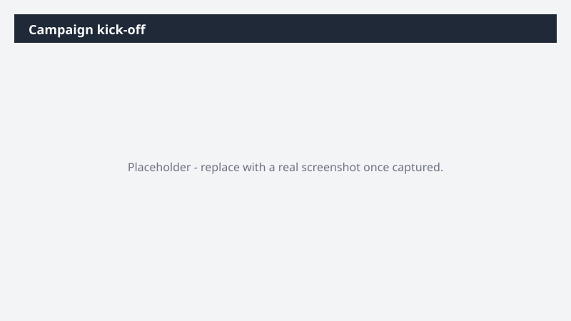

# Campaign kick-off

Stand up a new campaign with a working brief, prior campaign learnings baked in, the right stakeholders, and a kickoff already on the calendar.

> ⚠ **Draft recipe — not yet verified.** This prompt is reproduced from the Microsoft Copilot Cowork Task Pack for Marketing. It has not been run against our tenant, so the output described below is the pack's stated expectation rather than an observed result. Validate before relying on it.

> **Tip.** Note: You can schedule this to run automatically by ending your prompt with "I want this prompt to run every Monday morning."

## Business value

Stand up a new campaign with a working brief, prior campaign learnings baked in, the right stakeholders, and a kickoff already on the calendar. A Word campaign brief - grounded in prior campaign performance and best practices - saved into a dedicated OneDrive workspace, plus a draft kickoff invite with relevant stakeholders.

## What it does

A Word campaign brief - grounded in prior campaign performance and best practices - saved into a dedicated OneDrive workspace, plus a draft kickoff invite with relevant stakeholders.

## Prerequisites

- Microsoft 365 Copilot licence with access to Cowork
- Fabric IQ plugin enabled in your Cowork session

## Step-by-step

1. Open Cowork and start a new task.
2. Confirm the required plugin is turned on under **+ > Customize**: Fabric IQ plugin enabled in your Cowork session.
3. Paste the prompt from `prompt.md`, replacing anything in square brackets with your own values.
4. Review the plan Cowork proposes before letting it run.
5. Check any drafted email or calendar change before approving it — the prompt holds them for review rather than sending.

## How Cowork works through it

1. Intake brief + email → Pull objectives and audience
2. Fabric IQ → Pull prior campaign performance + apply learnings
3. OneDrive → Spin up the workspace folder
4. Org directory → Identify the right stakeholders
5. Synthesize → Working brief with prior-campaign learnings applied
6. File → Brief into workspace
7. Calendar → Send the kick-off invite

## Expected output

A Word campaign brief - grounded in prior campaign performance and best practices - saved into a dedicated OneDrive workspace, plus a draft kickoff invite with relevant stakeholders.

## Source

Adapted from the **Microsoft Copilot Cowork Task Pack for Marketing**, a task pack Microsoft publishes for customers. The prompt is reproduced as published; the surrounding recipe metadata, process tagging, and guidance are the Cookbook's.

## Skills used

OOTB: Word, Email, Calendar Management, Scheduling, Communications

Plugin: fabric-iq

## License

CC-BY-4.0 — see repo `LICENSE`.
