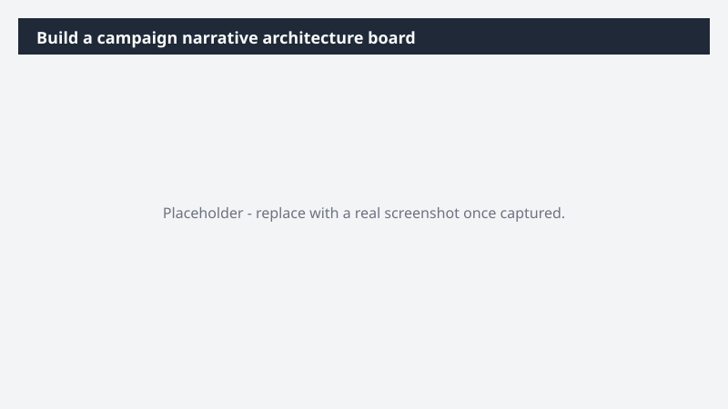

# Build a campaign narrative architecture board

Turn a campaign narrative into a structured visual the team can pressure-test before any copy gets written - so the story holds together across every audience, channel, and asset.

> ⚠ **Draft recipe — not yet verified.** This prompt is reproduced from the Microsoft Copilot Cowork Task Pack for Marketing. It has not been run against our tenant, so the output described below is the pack's stated expectation rather than an observed result. Validate before relying on it.

## Business value

Turn a campaign narrative into a structured visual the team can pressure-test before any copy gets written - so the story holds together across every audience, channel, and asset. A Miro narrative architecture board mapping the core campaign story, message pillars, proof points, and audience adaptations - so the entire team is building from the same architecture, not interpreting the brief differently.

## What it does

A Miro narrative architecture board mapping the core campaign story, message pillars, proof points, and audience adaptations - so the entire team is building from the same architecture, not interpreting the brief differently.

## Prerequisites

- Microsoft 365 Copilot licence with access to Cowork
- Miro plugin enabled and connected to your workspace

## Step-by-step

1. Open Cowork and start a new task.
2. Confirm the required plugin is turned on under **+ > Customize**: Miro plugin enabled and connected to your workspace.
3. Paste the prompt from `prompt.md`, replacing anything in square brackets with your own values.
4. Review the plan Cowork proposes before letting it run.
5. Check any drafted email or calendar change before approving it — the prompt holds them for review rather than sending.

## How Cowork works through it

1. Brief + Messaging + audience defs → Pull positioning context
2. Structure → Core narrative → pillars → proof points → audience adaptations
3. Map → Story flow + audience branches
4. Miro → Build narrative architecture
5. Generate → Companion tracking table
6. Surface → Coverage gaps for review

## Expected output

A Miro narrative architecture board mapping the core campaign story, message pillars, proof points, and audience adaptations - so the entire team is building from the same architecture, not interpreting the brief differently.

## Source

Adapted from the **Microsoft Copilot Cowork Task Pack for Marketing**, a task pack Microsoft publishes for customers. The prompt is reproduced as published; the surrounding recipe metadata, process tagging, and guidance are the Cookbook's.

## Skills used

OOTB: —

Plugin: miro

## License

CC-BY-4.0 — see repo `LICENSE`.
