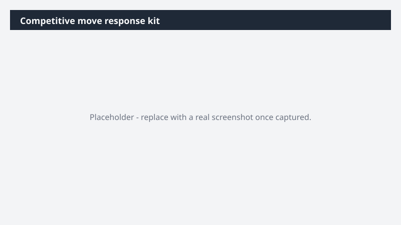

# Competitive move response kit

Get a coordinated response to [Competitor]'s move on the table by end of day - one story across PR, sales, and field - backed by our own performance proof.

> ⚠ **Draft recipe — not yet verified.** This prompt is reproduced from the Microsoft Copilot Cowork Task Pack for Marketing. It has not been run against our tenant, so the output described below is the pack's stated expectation rather than an observed result. Validate before relying on it.

## Business value

Get a coordinated response to [Competitor]'s move on the table by end of day - one story across PR, sales, and field - backed by our own performance proof. A response kit - exec overview deck, internal guidance memo, customer talking points, sales objection sheet, Teams update - substantiated with Fabric IQ data and routed to PR, sales enablement, and field marketing.

## What it does

A response kit - exec overview deck, internal guidance memo, customer talking points, sales objection sheet, Teams update - substantiated with Fabric IQ data and routed to PR, sales enablement, and field marketing.

## Prerequisites

- Microsoft 365 Copilot licence with access to Cowork
- Fabric IQ plugin enabled in your Cowork session

## Step-by-step

1. Open Cowork and start a new task.
2. Confirm the required plugin is turned on under **+ > Customize**: Fabric IQ plugin enabled in your Cowork session.
3. Paste the prompt from `prompt.md`, replacing anything in square brackets with your own values.
4. Review the plan Cowork proposes before letting it run.
5. Check any drafted email or calendar change before approving it — the prompt holds them for review rather than sending.

## How Cowork works through it

1. Web → Read the announcement and coverage
2. Messaging doc + Battlecard [Folder] → Ground response in our positioning
3. Fabric IQ → Pull share, growth, momentum, win rate data
4. Teams [Team channel] → Pull prior competitor discussions back into context
5. Draft → Exec deck, guidance, talking points, objection sheet, Teams update
6. Org directory → Identify reviewers
7. Route → Kit to reviewers
8. Send → Team update on competitive response

## Expected output

A response kit - exec overview deck, internal guidance memo, customer talking points, sales objection sheet, Teams update - substantiated with Fabric IQ data and routed to PR, sales enablement, and field marketing.

## Source

Adapted from the **Microsoft Copilot Cowork Task Pack for Marketing**, a task pack Microsoft publishes for customers. The prompt is reproduced as published; the surrounding recipe metadata, process tagging, and guidance are the Cookbook's.

## Skills used

OOTB: Word, PowerPoint, Email, Communications

Plugin: fabric-iq

## License

CC-BY-4.0 — see repo `LICENSE`.
