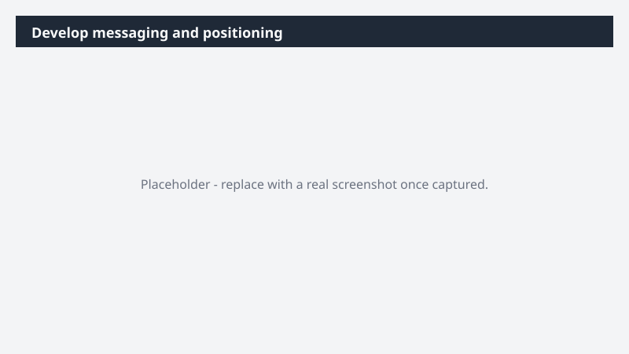

# Develop messaging and positioning

Move messaging development out of scattered docs into one working surface the team can pressure-test together.

> ⚠ **Draft recipe — not yet verified.** This prompt is reproduced from the Microsoft Copilot Cowork Task Pack for Marketing. It has not been run against our tenant, so the output described below is the pack's stated expectation rather than an observed result. Validate before relying on it.

## Business value

Move messaging development out of scattered docs into one working surface the team can pressure-test together. A Monday.com board capturing value pillars, persona messaging, business alignment, and competitive positioning - grounded in your real product, customer, and competitive context.

## What it does

A Monday.com board capturing value pillars, persona messaging, business alignment, and competitive positioning - grounded in your real product, customer, and competitive context.

## Prerequisites

- Microsoft 365 Copilot licence with access to Cowork
- monday.com plugin enabled and connected to your workspace

## Step-by-step

1. Open Cowork and start a new task.
2. Confirm the required plugin is turned on under **+ > Customize**: monday.com plugin enabled and connected to your workspace.
3. Paste the prompt from `prompt.md`, replacing anything in square brackets with your own values.
4. Review the plan Cowork proposes before letting it run.
5. Check any drafted email or calendar change before approving it — the prompt holds them for review rather than sending.

## How Cowork works through it

1. Product Strategy + Customer Insights + Competitive Summary + Brand Voice → Pull source context
2. Synthesize → Value pillars, proof points, customer challenges
3. Translate → Features into benefits with use case examples
4. Build → Persona messaging cards (goals · challenges · triggers · metrics)
5. Align → Pillars to business objectives + target audience
6. Generate → Competitive positioning statements
7. Monday.com → Build messaging and positioning board
8. Flag → Gaps where input is needed

## Expected output

A Monday.com board capturing value pillars, persona messaging, business alignment, and competitive positioning - grounded in your real product, customer, and competitive context.

## Source

Adapted from the **Microsoft Copilot Cowork Task Pack for Marketing**, a task pack Microsoft publishes for customers. The prompt is reproduced as published; the surrounding recipe metadata, process tagging, and guidance are the Cookbook's.

## Skills used

OOTB: —

Plugin: monday-com

## License

CC-BY-4.0 — see repo `LICENSE`.
