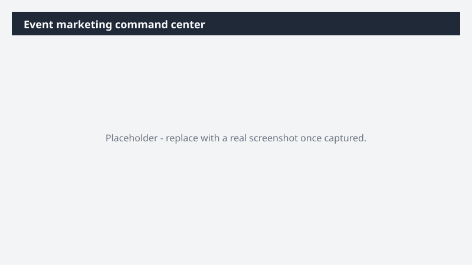

# Event marketing command center

Prep every moment of [Event name] - speaker slots, customer meetings, content drops, social posts - and bring it together in a single interactive command center with live event KPIs.

> ⚠ **Draft recipe — not yet verified.** This prompt is reproduced from the Microsoft Copilot Cowork Task Pack for Marketing. It has not been run against our tenant, so the output described below is the pack's stated expectation rather than an observed result. Validate before relying on it.

## Business value

Prep every moment of [Event name] - speaker slots, customer meetings, content drops, social posts - and bring it together in a single interactive command center with live event KPIs. An interactive HTML command center with one row per event moment linked to its supporting artifact, plus live event KPIs from Fabric IQ - registrations, pipeline influenced, attendee engagement - surfaced alongside the programming.

## What it does

An interactive HTML command center with one row per event moment linked to its supporting artifact, plus live event KPIs from Fabric IQ - registrations, pipeline influenced, attendee engagement - surfaced alongside the programming.

## Prerequisites

- Microsoft 365 Copilot licence with access to Cowork
- Fabric IQ plugin enabled in your Cowork session

## Step-by-step

1. Open Cowork and start a new task.
2. Confirm the required plugin is turned on under **+ > Customize**: Fabric IQ plugin enabled in your Cowork session.
3. Paste the prompt from `prompt.md`, replacing anything in square brackets with your own values.
4. Review the plan Cowork proposes before letting it run.
5. Check any drafted email or calendar change before approving it — the prompt holds them for review rather than sending.

## How Cowork works through it

1. OneDrive [Folder] → Read the event materials,
2. Calendar → Pull customer meetings and speaker slots
3. Teams [Team channel] → Capture programming detail
4. Fabric IQ → Pull event performance data
5. Prior interactions → Ground customer briefs in real history
6. Brief → Speaker prep, event dossier, customer one-pagers
7. Draft → Social copy and follow-up emails
8. Thread → Every artifact + KPI into command center rows
9. Deliver → Interactive HTML command center

## Expected output

An interactive HTML command center with one row per event moment linked to its supporting artifact, plus live event KPIs from Fabric IQ - registrations, pipeline influenced, attendee engagement - surfaced alongside the programming.

## Source

Adapted from the **Microsoft Copilot Cowork Task Pack for Marketing**, a task pack Microsoft publishes for customers. The prompt is reproduced as published; the surrounding recipe metadata, process tagging, and guidance are the Cookbook's.

## Skills used

OOTB: Word, PowerPoint, Email, Calendar Management, Meetings

Plugin: fabric-iq

## License

CC-BY-4.0 — see repo `LICENSE`.
