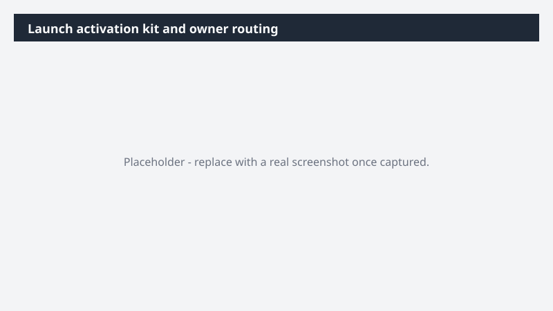

# Launch activation kit and owner routing

Build the full launch kit across customer, field, partner, exec, and creator audiences - grounded in real performance baselines and proof points - and get every asset to the right owner with a review deadline.

> ⚠ **Draft recipe — not yet verified.** This prompt is reproduced from the Microsoft Copilot Cowork Task Pack for Marketing. It has not been run against our tenant, so the output described below is the pack's stated expectation rather than an observed result. Validate before relying on it.

## Business value

Build the full launch kit across customer, field, partner, exec, and creator audiences - grounded in real performance baselines and proof points - and get every asset to the right owner with a review deadline. A fully-routed launch package across Word, PowerPoint, and Excel - every asset substantiated with Fabric IQ performance data, sequenced by audience beat, filed into a launch workspace by owner, with review requests sent.

## What it does

A fully-routed launch package across Word, PowerPoint, and Excel - every asset substantiated with Fabric IQ performance data, sequenced by audience beat, filed into a launch workspace by owner, with review requests sent.

## Prerequisites

- Microsoft 365 Copilot licence with access to Cowork
- Fabric IQ plugin enabled in your Cowork session

## Step-by-step

1. Open Cowork and start a new task.
2. Confirm the required plugin is turned on under **+ > Customize**: Fabric IQ plugin enabled in your Cowork session.
3. Paste the prompt from `prompt.md`, replacing anything in square brackets with your own values.
4. Review the plan Cowork proposes before letting it run.
5. Check any drafted email or calendar change before approving it — the prompt holds them for review rather than sending.

## How Cowork works through it

1. OneDrive [Launch folder] → Read the launch materials
2. Messaging doc → Ground every asset in approved positioning
3. Launch kickoff meeting + exec guidance → Establish launch narrative, strategic priorities, and scope
4. Fabric IQ → Pull performance baselines + proof points for substantiation
5. External news + market activity → Ground in competitive context
6. Org directory + [Owner map] → Map each asset to its owner
7. Adapt → Assets across Word · PowerPoint · Excel
8. Sequence → Owner review deadlines by beat
9. File → Workspace folder organized by owner
10. Route → Review requests to owners

## Expected output

A fully-routed launch package across Word, PowerPoint, and Excel - every asset substantiated with Fabric IQ performance data, sequenced by audience beat, filed into a launch workspace by owner, with review requests sent.

## Source

Adapted from the **Microsoft Copilot Cowork Task Pack for Marketing**, a task pack Microsoft publishes for customers. The prompt is reproduced as published; the surrounding recipe metadata, process tagging, and guidance are the Cookbook's.

## Skills used

OOTB: Word, Excel, PowerPoint, Email, Calendar Management, Meetings

Plugin: fabric-iq

## License

CC-BY-4.0 — see repo `LICENSE`.
