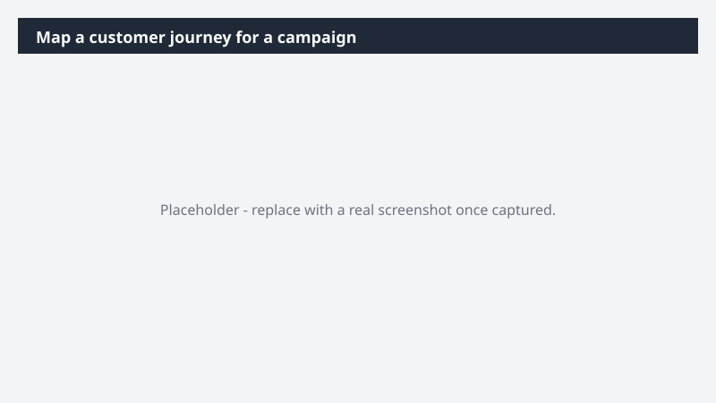

# Map a customer journey for a campaign

Turn a campaign brief into a clear, visual customer journey the team can rally around - instead of arguing over interpretations of the same Word doc.

> ⚠ **Draft recipe — not yet verified.** This prompt is reproduced from the Microsoft Copilot Cowork Task Pack for Marketing. It has not been run against our tenant, so the output described below is the pack's stated expectation rather than an observed result. Validate before relying on it.

## Business value

Turn a campaign brief into a clear, visual customer journey the team can rally around - instead of arguing over interpretations of the same Word doc. A Miro customer journey board mapping the audience's path from awareness through conversion - stages, touchpoints, channels, and message moments visualized in one place - paired with a tracking table for asset alignment.

## What it does

A Miro customer journey board mapping the audience's path from awareness through conversion - stages, touchpoints, channels, and message moments visualized in one place - paired with a tracking table for asset alignment.

## Prerequisites

- Microsoft 365 Copilot licence with access to Cowork
- Miro plugin enabled and connected to your workspace

## Step-by-step

1. Open Cowork and start a new task.
2. Confirm the required plugin is turned on under **+ > Customize**: Miro plugin enabled and connected to your workspace.
3. Paste the prompt from `prompt.md`, replacing anything in square brackets with your own values.
4. Review the plan Cowork proposes before letting it run.
5. Check any drafted email or calendar change before approving it — the prompt holds them for review rather than sending.

## How Cowork works through it

1. Brief + audience definition + Messaging → Pull campaign context
2. Team channel → Capture strategy threads
3. Structure → Awareness → consideration → decision → post-conversion
4. Map → Mindset, channels, messages, assets per stage
5. Miro → Build journey board
6. Generate → Companion tracking table
7. Flag → Channel or asset gaps

## Expected output

A Miro customer journey board mapping the audience's path from awareness through conversion - stages, touchpoints, channels, and message moments visualized in one place - paired with a tracking table for asset alignment.

## Source

Adapted from the **Microsoft Copilot Cowork Task Pack for Marketing**, a task pack Microsoft publishes for customers. The prompt is reproduced as published; the surrounding recipe metadata, process tagging, and guidance are the Cookbook's.

## Skills used

OOTB: —

Plugin: miro

## License

CC-BY-4.0 — see repo `LICENSE`.
