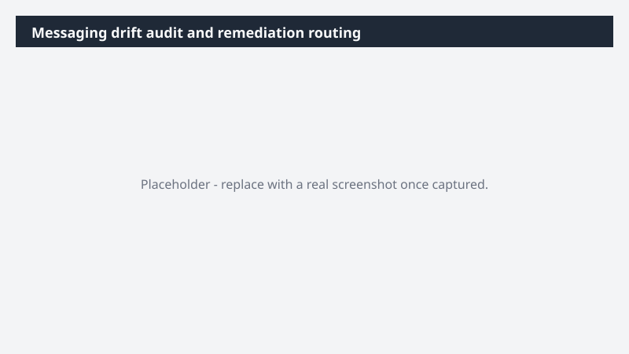

# Messaging drift audit and remediation routing

Catch messaging drift across every asset in [Folder] before it shows up in market.

> ⚠ **Draft recipe — not yet verified.** This prompt is reproduced from the Microsoft Copilot Cowork Task Pack for Marketing. It has not been run against our tenant, so the output described below is the pack's stated expectation rather than an observed result. Validate before relying on it.

> **Tip.** Note: Cowork reads and audits files in place. It surfaces a complete action list with owners so cleanup happens in priority order - no files are changed in the process.

## Business value

Catch messaging drift across every asset in [Folder] before it shows up in market. A sortable Excel audit report flagging every inconsistency by severity, recommended fix, and the right owner - so cleanup happens in priority order.

## What it does

A sortable Excel audit report flagging every inconsistency by severity, recommended fix, and the right owner - so cleanup happens in priority order.

## Prerequisites

- Microsoft 365 Copilot licence with access to Cowork

## Step-by-step

1. Open Cowork and start a new task.
2. Paste the prompt from `prompt.md`, replacing anything in square brackets with your own values.
3. Review the plan Cowork proposes before letting it run.
4. Check any drafted email or calendar change before approving it — the prompt holds them for review rather than sending.

## How Cowork works through it

1. OneDrive [Folder] → Read every asset in full
2. Messaging doc + Brand guide → Ground audit in the approved standard
3. Compare → Each asset against the standard
4. Categorize → Critical · Major · Minor
5. Capture → Issue · impact · fix
6. Map → Owner per finding
7. Route → Findings via Excel
8. Deliver → Sortable audit report

## Expected output

A sortable Excel audit report flagging every inconsistency by severity, recommended fix, and the right owner - so cleanup happens in priority order.

## Source

Adapted from the **Microsoft Copilot Cowork Task Pack for Marketing**, a task pack Microsoft publishes for customers. The prompt is reproduced as published; the surrounding recipe metadata, process tagging, and guidance are the Cookbook's.

## Skills used

OOTB: Excel

Plugin: none required

## License

CC-BY-4.0 — see repo `LICENSE`.
