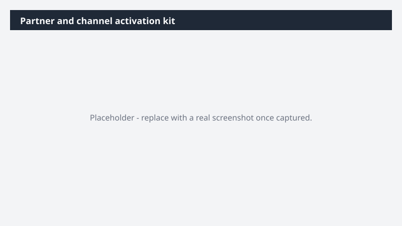

# Partner and channel activation kit

Adapt the [Product/Campaign name] launch materials for partners and channel teams and route them for review.

> ⚠ **Draft recipe — not yet verified.** This prompt is reproduced from the Microsoft Copilot Cowork Task Pack for Marketing. It has not been run against our tenant, so the output described below is the pack's stated expectation rather than an observed result. Validate before relying on it.

## Business value

Adapt the [Product/Campaign name] launch materials for partners and channel teams and route them for review. A partner-ready and channel-ready activation kit across Word and Excel, plus a routing plan so partner, field, and channel marketing can move fast.

## What it does

A partner-ready and channel-ready activation kit across Word and Excel, plus a routing plan so partner, field, and channel marketing can move fast.

## Prerequisites

- Microsoft 365 Copilot licence with access to Cowork

## Step-by-step

1. Open Cowork and start a new task.
2. Paste the prompt from `prompt.md`, replacing anything in square brackets with your own values.
3. Review the plan Cowork proposes before letting it run.
4. Check any drafted email or calendar change before approving it — the prompt holds them for review rather than sending.

## How Cowork works through it

1. OneDrive [Folder] → Read the launch materials
2. Messaging doc → Ground every adaptation in approved positioning
3. Adapt → One-pager · talking points · FAQ
4. Adapt → Email template · social pack
5. Org directory → Identify partner and channel owners
6. Route → Kit to owners for review

## Expected output

A partner-ready and channel-ready activation kit across Word and Excel, plus a routing plan so partner, field, and channel marketing can move fast.

## Source

Adapted from the **Microsoft Copilot Cowork Task Pack for Marketing**, a task pack Microsoft publishes for customers. The prompt is reproduced as published; the surrounding recipe metadata, process tagging, and guidance are the Cookbook's.

## Skills used

OOTB: Word, Excel, Email, Communications

Plugin: none required

## License

CC-BY-4.0 — see repo `LICENSE`.
