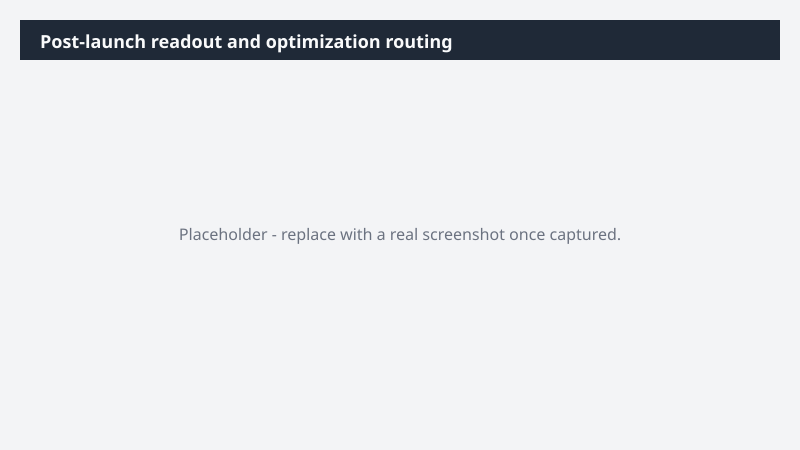

# Post-launch readout and optimization routing

Close the [Product name] launch loop - what worked, what didn't, and what comes next - grounded in live launch data, not exported snapshots.

> ⚠ **Draft recipe — not yet verified.** This prompt is reproduced from the Microsoft Copilot Cowork Task Pack for Marketing. It has not been run against our tenant, so the output described below is the pack's stated expectation rather than an observed result. Validate before relying on it.

## Business value

Close the [Product name] launch loop - what worked, what didn't, and what comes next - grounded in live launch data, not exported snapshots. A Word executive summary as the cover, a PowerPoint readout deck for exec review, and an owner-routed Excel optimization action plan - all built directly from Fabric IQ launch performance data.

## What it does

A Word executive summary as the cover, a PowerPoint readout deck for exec review, and an owner-routed Excel optimization action plan - all built directly from Fabric IQ launch performance data.

## Prerequisites

- Microsoft 365 Copilot licence with access to Cowork
- Fabric IQ plugin enabled in your Cowork session

## Step-by-step

1. Open Cowork and start a new task.
2. Confirm the required plugin is turned on under **+ > Customize**: Fabric IQ plugin enabled in your Cowork session.
3. Paste the prompt from `prompt.md`, replacing anything in square brackets with your own values.
4. Review the plan Cowork proposes before letting it run.
5. Check any drafted email or calendar change before approving it — the prompt holds them for review rather than sending.

## How Cowork works through it

1. Fabric IQ → Pull live launch performance + KPI movement
2. Campaign [Folder] → Pull creative variants into the readout
3. Teams [Leadership channel] → Bring forward exec context
4. Email + [Marketing channel] → Capture customer reception
5. Analyze → Drivers · underperformers · plan delta
6. Draft → Exec summary · readout deck
7. Route → Action plan to owners
8. Deliver → Readout package

## Expected output

A Word executive summary as the cover, a PowerPoint readout deck for exec review, and an owner-routed Excel optimization action plan - all built directly from Fabric IQ launch performance data.

## Source

Adapted from the **Microsoft Copilot Cowork Task Pack for Marketing**, a task pack Microsoft publishes for customers. The prompt is reproduced as published; the surrounding recipe metadata, process tagging, and guidance are the Cookbook's.

## Skills used

OOTB: Word, Excel, PowerPoint, Email

Plugin: fabric-iq

## License

CC-BY-4.0 — see repo `LICENSE`.
