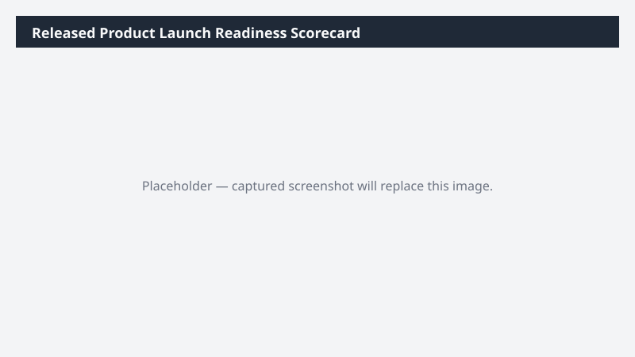

# Released Product Launch Readiness Scorecard

Scores released products on launch readiness based on setup completeness (dimensions, pricing, BOM, tax, default order settings) and produces a scorecard.

> ⚠ **Draft recipe — not yet verified.** The prompt, OOTB skill list, and plugin actions named below are starter content. No one has run this against a live Cowork tenant with the Dynamics 365 ERP plugin yet. Validate before relying on it.

## Business value

Prevents launch-day surprises by catching the setup gaps that block sales orders, MRP runs, or warehouse picking while there is still time to fix them.

## What it does

Scores newly released products on readiness for launch and surfaces the specific setup gaps blocking each one.

## Prerequisites

- Dynamics 365 F&SCM access with the Product designer or Item maintainer role
- Cowork D365 ERP plugin enabled

## Step-by-step

1. Paste the prompt in Cowork.
2. Review the workbook; assign owners to fix the Red and Amber items.
3. Post the Adaptive Card to the product-launch Teams channel.

## Expected output

Workbook with per-product readiness score and an Adaptive Card summary.

## Skills used

OOTB: Excel, Adaptive Cards
Plugin actions: dynamics-365-erp/data_find_entity_type, dynamics-365-erp/data_find_entities_sql

## License

CC-BY-4.0 — see repo `LICENSE`.
