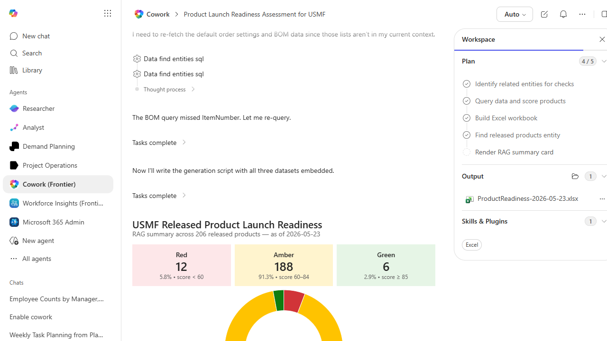

# Released Product Launch Readiness Scorecard

Scores released products on launch readiness based on setup completeness (dimensions, pricing, BOM, tax, default order settings) and produces a scorecard.

> ℹ **Tenant data caveat.** Validated end-to-end against a live Cowork tenant on 2026-05-23 with USMF. Cowork scored all 206 released products on 6 readiness checks (dimension groups, default order settings, active sales price, BOM for manufactured items, sales tax group, item approved). Score = checks passed / 6 x 100. Real results: Red 12 products (5.8%, score < 60), Amber 188 products (91.3%, score 60-84), Green 6 products (2.9%, score >= 85). Real workbook ProductReadiness-2026-05-23.xlsx with one row per product, per-check 1/0 columns, total score, and RAG indicator. Cowork also rendered a donut-chart visualization of the RAG distribution inline in the chat.

## Business value

Prevents launch-day surprises by catching the setup gaps that block sales orders, MRP runs, or warehouse picking while there is still time to fix them.

## What it does

Scores newly released products on readiness for launch and surfaces the specific setup gaps blocking each one.

## Prerequisites

- Dynamics 365 F&SCM access with the Product designer or Item maintainer role
- Cowork D365 ERP plugin enabled

## Step-by-step

1. Paste the prompt in Cowork.
2. Review the workbook; assign owners to fix the Red and Amber items.
3. Post the Adaptive Card to the product-launch Teams channel.

## Expected output

Workbook with per-product readiness score and an Adaptive Card summary.

## Skills used

OOTB: Excel, Adaptive Cards
Plugin actions: dynamics-365-erp/data_find_entity_type, dynamics-365-erp/data_find_entities_sql

## License

CC-BY-4.0 — see repo `LICENSE`.
