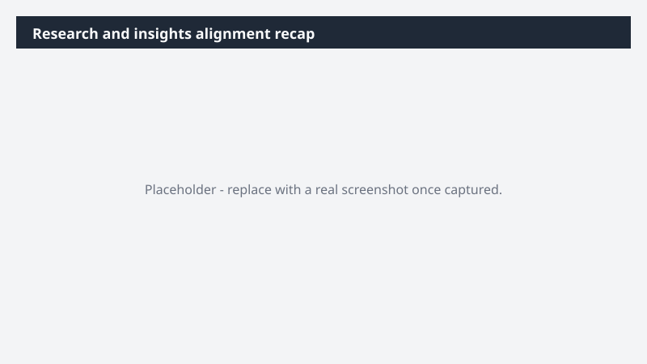

# Research and insights alignment recap

Surface everything that came out of this week's research sessions - what landed, what didn't, and what still needs an owner.

> ⚠ **Draft recipe — not yet verified.** This prompt is reproduced from the Microsoft Copilot Cowork Task Pack for Marketing. It has not been run against our tenant, so the output described below is the pack's stated expectation rather than an observed result. Validate before relying on it.

## Business value

Surface everything that came out of this week's research sessions - what landed, what didn't, and what still needs an owner. A Teams post recapping decisions made, open issues, and named next steps - posted to the team channel so everyone walks into next week aligned.

## What it does

A Teams post recapping decisions made, open issues, and named next steps - posted to the team channel so everyone walks into next week aligned.

## Prerequisites

- Microsoft 365 Copilot licence with access to Cowork

## Step-by-step

1. Open Cowork and start a new task.
2. Paste the prompt from `prompt.md`, replacing anything in square brackets with your own values.
3. Review the plan Cowork proposes before letting it run.
4. Check any drafted email or calendar change before approving it — the prompt holds them for review rather than sending.

## How Cowork works through it

1. Meetings (this week) → Capture what each stakeholder said
2. Teams + email → Pull decisions and open threads
3. Sort → Decided · open · pending
4. Route → Owner per follow-up
5. Deliver → Alignment recap in Word

## Expected output

A Teams post recapping decisions made, open issues, and named next steps - posted to the team channel so everyone walks into next week aligned.

## Source

Adapted from the **Microsoft Copilot Cowork Task Pack for Marketing**, a task pack Microsoft publishes for customers. The prompt is reproduced as published; the surrounding recipe metadata, process tagging, and guidance are the Cookbook's.

## Skills used

OOTB: Email, Meetings, Communications

Plugin: none required

## License

CC-BY-4.0 — see repo `LICENSE`.
