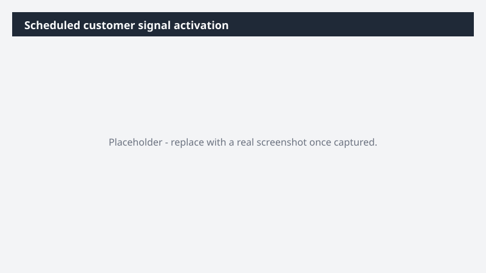

# Scheduled customer signal activation

Run a weekly customer-signal sweep that feeds next week's messaging, content, and campaign moves - correlated against live campaign performance.

> ⚠ **Draft recipe — not yet verified.** This prompt is reproduced from the Microsoft Copilot Cowork Task Pack for Marketing. It has not been run against our tenant, so the output described below is the pack's stated expectation rather than an observed result. Validate before relying on it.

> **Tip.** Note: This is a scheduled Cowork prompt - describe what you want and when, and Cowork runs it on a recurring schedule in the background. Pair it with a saved skill so your team can subscribe to the same signal. See Cowork skills.

## Business value

Run a weekly customer-signal sweep that feeds next week's messaging, content, and campaign moves - correlated against live campaign performance. Every Friday, a Word customer signal brief - themes, objections, message implications, recommended campaign adjustments, and owner follow-ups - grounded in customer voice and Fabric IQ campaign response data.

## What it does

Every Friday, a Word customer signal brief - themes, objections, message implications, recommended campaign adjustments, and owner follow-ups - grounded in customer voice and Fabric IQ campaign response data.

## Prerequisites

- Microsoft 365 Copilot licence with access to Cowork
- Fabric IQ plugin enabled in your Cowork session

## Step-by-step

1. Open Cowork and start a new task.
2. Confirm the required plugin is turned on under **+ > Customize**: Fabric IQ plugin enabled in your Cowork session.
3. Paste the prompt from `prompt.md`, replacing anything in square brackets with your own values.
4. Review the plan Cowork proposes before letting it run.
5. Check any drafted email or calendar change before approving it — the prompt holds them for review rather than sending.

## How Cowork works through it

1. Customer calls [Folder] → Surface customer themes
2. Email (sales feedback) → Pull front-line patterns into view
3. Teams [Sales + CS channels] → Read live discussions
4. Support [Folder] → Identify support themes
5. Web / research feeds → Capture market signals
6. Synthesize → Themes · objections · implications
7. Post → Summary to [Marketing channel]
8. Queue → Owner-specific follow-ups

## Expected output

Every Friday, a Word customer signal brief - themes, objections, message implications, recommended campaign adjustments, and owner follow-ups - grounded in customer voice and Fabric IQ campaign response data.

## Source

Adapted from the **Microsoft Copilot Cowork Task Pack for Marketing**, a task pack Microsoft publishes for customers. The prompt is reproduced as published; the surrounding recipe metadata, process tagging, and guidance are the Cookbook's.

## Skills used

OOTB: Word, Email, Scheduling, Communications

Plugin: fabric-iq

## License

CC-BY-4.0 — see repo `LICENSE`.
