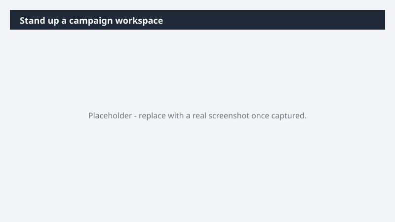

# Stand up a campaign workspace

Spin up a working campaign board grounded in real context - not a blank template - so the team has a single source of truth before the kickoff calendar invite goes out.

> ⚠ **Draft recipe — not yet verified.** This prompt is reproduced from the Microsoft Copilot Cowork Task Pack for Marketing. It has not been run against our tenant, so the output described below is the pack's stated expectation rather than an observed result. Validate before relying on it.

## Business value

Spin up a working campaign board grounded in real context - not a blank template - so the team has a single source of truth before the kickoff calendar invite goes out. A Monday.com campaign board capturing workstreams, owners, deliverables, milestones, and key dates - built from your intake brief and recent campaign threads - so the campaign starts the way you want it to run.

## What it does

A Monday.com campaign board capturing workstreams, owners, deliverables, milestones, and key dates - built from your intake brief and recent campaign threads - so the campaign starts the way you want it to run.

## Prerequisites

- Microsoft 365 Copilot licence with access to Cowork
- monday.com plugin enabled and connected to your workspace

## Step-by-step

1. Open Cowork and start a new task.
2. Confirm the required plugin is turned on under **+ > Customize**: monday.com plugin enabled and connected to your workspace.
3. Paste the prompt from `prompt.md`, replacing anything in square brackets with your own values.
4. Review the plan Cowork proposes before letting it run.
5. Check any drafted email or calendar change before approving it — the prompt holds them for review rather than sending.

## How Cowork works through it

1. Intake brief + email + Teams → Identify workstreams + context
2. Extract → Owners, deliverables, milestones
3. Cluster → Tasks by workstream
4. Structure → Board schema + groupings
5. Monday.com → Create campaign board
6. Populate → Pre-fill what's inferable
7. Flag → Open decisions before kickoff

## Expected output

A Monday.com campaign board capturing workstreams, owners, deliverables, milestones, and key dates - built from your intake brief and recent campaign threads - so the campaign starts the way you want it to run.

## Source

Adapted from the **Microsoft Copilot Cowork Task Pack for Marketing**, a task pack Microsoft publishes for customers. The prompt is reproduced as published; the surrounding recipe metadata, process tagging, and guidance are the Cookbook's.

## Skills used

OOTB: Email, Communications

Plugin: monday-com

## License

CC-BY-4.0 — see repo `LICENSE`.
