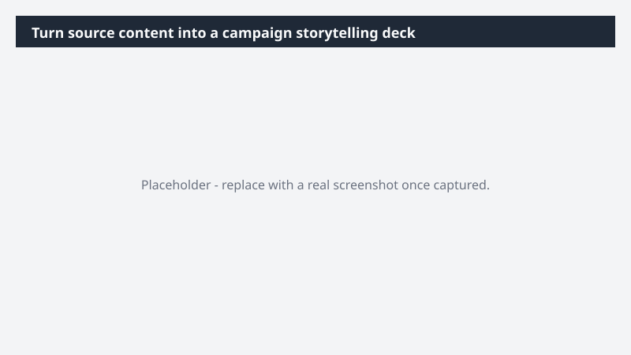

# Turn source content into a campaign storytelling deck

Move from raw inputs - a research debrief transcript, customer interview, or campaign brief - to a polished storytelling deck, with iteration built into the flow instead of bolted on after.

> ⚠ **Draft recipe — not yet verified.** This prompt is reproduced from the Microsoft Copilot Cowork Task Pack for Marketing. It has not been run against our tenant, so the output described below is the pack's stated expectation rather than an observed result. Validate before relying on it.

## Business value

Move from raw inputs - a research debrief transcript, customer interview, or campaign brief - to a polished storytelling deck, with iteration built into the flow instead of bolted on after.

## What it does

## Prerequisites

- Microsoft 365 Copilot licence with access to Cowork
- Prezi plugin enabled and connected to your account

## Step-by-step

1. Open Cowork and start a new task.
2. Confirm the required plugin is turned on under **+ > Customize**: Prezi plugin enabled and connected to your account.
3. Paste the prompt from `prompt.md`, replacing anything in square brackets with your own values.
4. Review the plan Cowork proposes before letting it run.
5. Check any drafted email or calendar change before approving it — the prompt holds them for review rather than sending.

## How Cowork works through it

1. Source → Read transcript / notes / brief in full
2. Identify → Key themes and narrative arc
3. Structure → Title · sections · next steps
4. Prezi → Build [X]-slide deck with visual treatment
5. Edit → Deepen slide [X] with additional content
6. Generate → Talk track across the deck
7. Deliver → Presentation-ready Prezi

## Expected output

## Source

Adapted from the **Microsoft Copilot Cowork Task Pack for Marketing**, a task pack Microsoft publishes for customers. The prompt is reproduced as published; the surrounding recipe metadata, process tagging, and guidance are the Cookbook's.

## Skills used

OOTB: PowerPoint, Meetings

Plugin: prezi

## License

CC-BY-4.0 — see repo `LICENSE`.
