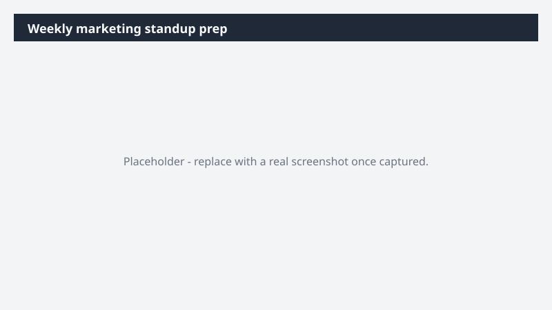

# Weekly marketing standup prep

Walk into Monday's standup with progress, blockers, owner updates, and live campaign performance already in front of you.

> ⚠ **Draft recipe — not yet verified.** This prompt is reproduced from the Microsoft Copilot Cowork Task Pack for Marketing. It has not been run against our tenant, so the output described below is the pack's stated expectation rather than an observed result. Validate before relying on it.

> **Tip.** Note: With the Fabric IQ plugin, Cowork pulls live campaign performance data - turning the standup brief into a campaign dashboard grounded in real numbers alongside the team's working signals.

## Business value

Walk into Monday's standup with progress, blockers, owner updates, and live campaign performance already in front of you. A Word standup brief - campaign progress, blockers, decisions, owner updates, and a live campaign performance read from Fabric IQ - ready to share at the meeting.

## What it does

A Word standup brief - campaign progress, blockers, decisions, owner updates, and a live campaign performance read from Fabric IQ - ready to share at the meeting.

## Prerequisites

- Microsoft 365 Copilot licence with access to Cowork
- Fabric IQ plugin enabled in your Cowork session

## Step-by-step

1. Open Cowork and start a new task.
2. Confirm the required plugin is turned on under **+ > Customize**: Fabric IQ plugin enabled in your Cowork session.
3. Paste the prompt from `prompt.md`, replacing anything in square brackets with your own values.
4. Review the plan Cowork proposes before letting it run.
5. Check any drafted email or calendar change before approving it — the prompt holds them for review rather than sending.

## How Cowork works through it

1. Teams [Team channel] → Read the past week of campaign chatter
2. Email → Pull thread decisions
3. Calendar → Anchor to standup slot
4. Fabric IQ → Pull live campaign performance + week-over-week deltas
5. Group → By campaign, then cross-cutting blockers
6. Sequence → Progress · blockers · decisions · owners · performance
7. Deliver → Standup brief in Word

## Expected output

A Word standup brief - campaign progress, blockers, decisions, owner updates, and a live campaign performance read from Fabric IQ - ready to share at the meeting.

## Source

Adapted from the **Microsoft Copilot Cowork Task Pack for Marketing**, a task pack Microsoft publishes for customers. The prompt is reproduced as published; the surrounding recipe metadata, process tagging, and guidance are the Cookbook's.

## Skills used

OOTB: Word, Email, Calendar Management, Meetings

Plugin: fabric-iq

## License

CC-BY-4.0 — see repo `LICENSE`.
