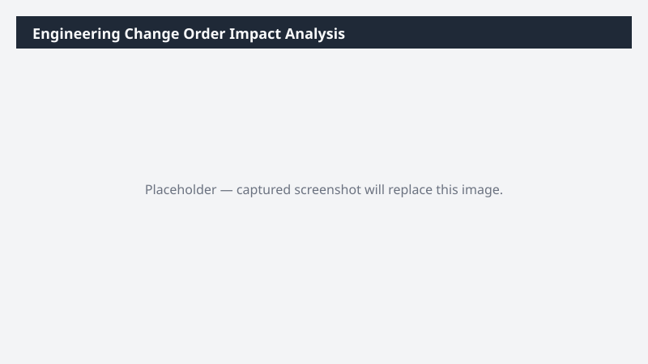

# Engineering Change Order Impact Analysis

For a proposed item change, finds every BOM, sales order, and inventory location affected and quantifies downstream impact.

> ⚠ **Draft recipe — not yet verified.** The prompt, OOTB skill list, and plugin actions named below are starter content. No one has run this against a live Cowork tenant with the Dynamics 365 ERP plugin yet. Validate before relying on it.

## Business value

Eliminates the 'didn't realize that part is in 14 other BOMs' surprise by surfacing the full blast radius of a proposed engineering change before it is approved.

## What it does

Builds a complete pre-change impact report (BOM usage, open orders, inventory, inbound POs) for a single item.

## Prerequisites

- Dynamics 365 F&SCM access with the Production or Item maintainer role
- Cowork D365 ERP plugin enabled

## Step-by-step

1. Paste the prompt and provide the item number when asked.
2. Review the workbook with the engineering change board.

## Expected output

Workbook with BOM/SO/PO/inventory impact sheets and a summary.

## Skills used

OOTB: Excel
Plugin actions: dynamics-365-erp/data_find_entity_type, dynamics-365-erp/data_find_entities_sql

## License

CC-BY-4.0 — see repo `LICENSE`.
