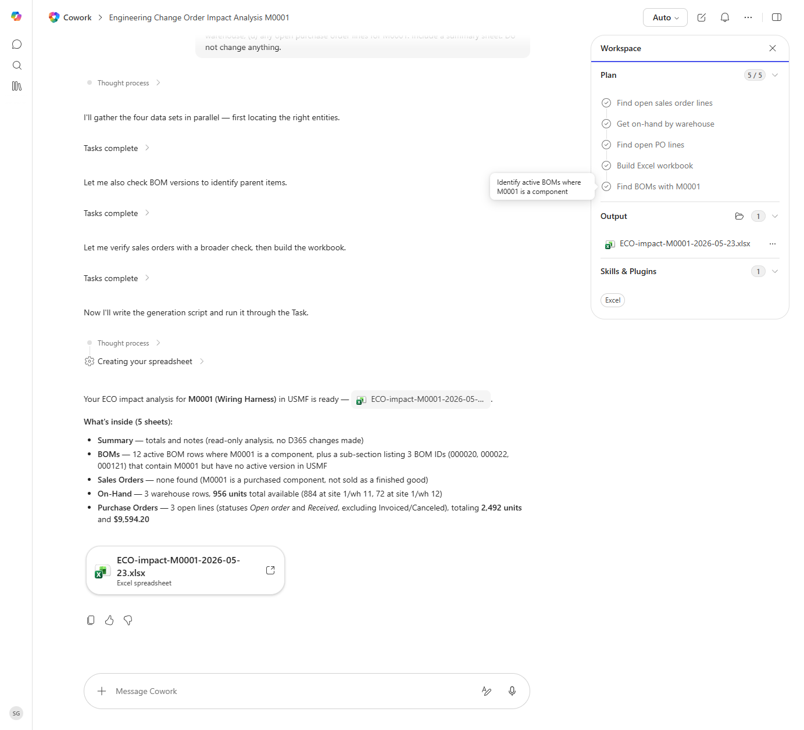

# Engineering Change Order Impact Analysis

For a proposed item change, finds every BOM, sales order, and inventory location affected and quantifies downstream impact.

> ℹ **Tenant data caveat.** Validated end-to-end against a live Cowork tenant on 2026-05-23 with USMF item M0001 (Wiring Harness). Cowork ran all five plan steps and produced 'ECO-impact-M0001-2026-05-23.xlsx' with 5 sheets. Findings: 12 active BOM rows use M0001 as a component (plus a flagged sub-section of 3 BOMs - 000020, 000022, 000121 - that contain M0001 but have no active version); 0 open sales orders (M0001 is a purchased component, not a finished good); 956 units total on-hand across 3 warehouses (884 at 1/wh 11, 72 at 1/wh 12); 3 open purchase order lines totalling 2,492 units and $9,594.20. No data was modified.

## Business value

Eliminates the 'didn't realize that part is in 14 other BOMs' surprise by surfacing the full blast radius of a proposed engineering change before it is approved.

## What it does

Builds a complete pre-change impact report (BOM usage, open orders, inventory, inbound POs) for a single item.

## Prerequisites

- Dynamics 365 F&SCM access with the Production or Item maintainer role
- Cowork D365 ERP plugin enabled

## Step-by-step

1. Paste the prompt and provide the item number when asked.
2. Review the workbook with the engineering change board.

## Expected output

Workbook with BOM/SO/PO/inventory impact sheets and a summary.

## Skills used

OOTB: Excel
Plugin actions: dynamics-365-erp/data_find_entity_type, dynamics-365-erp/data_find_entities_sql

## License

CC-BY-4.0 — see repo `LICENSE`.
