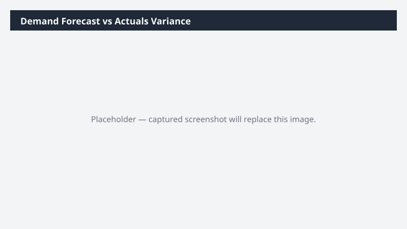

# Demand Forecast vs Actuals Variance

Compares demand forecast lines to actual sales orders for the same period and items, computes forecast accuracy, and flags poor performers.

> ⚠ **Draft recipe — not yet verified.** The prompt, OOTB skill list, and plugin actions named below are starter content. No one has run this against a live Cowork tenant with the Dynamics 365 ERP plugin yet. Validate before relying on it.

## Business value

Surfaces which items and which planners are consistently over- or under-forecasting so demand planning can be improved where it matters most — and inventory dollars stop pooling on the wrong SKUs.

## What it does

Quantifies forecast accuracy at the item level and routes poor-performing items to the right planner.

## Prerequisites

- Dynamics 365 F&SCM access with the Demand planner role
- Cowork D365 ERP plugin enabled

## Step-by-step

1. Paste the prompt.
2. Review with the demand planning team and adjust forecast models on the worst items.

## Expected output

Workbook with poor/all/by-planner accuracy sheets.

## Skills used

OOTB: Excel
Plugin actions: dynamics-365-erp/data_find_entity_type, dynamics-365-erp/data_find_entities_sql

## License

CC-BY-4.0 — see repo `LICENSE`.
