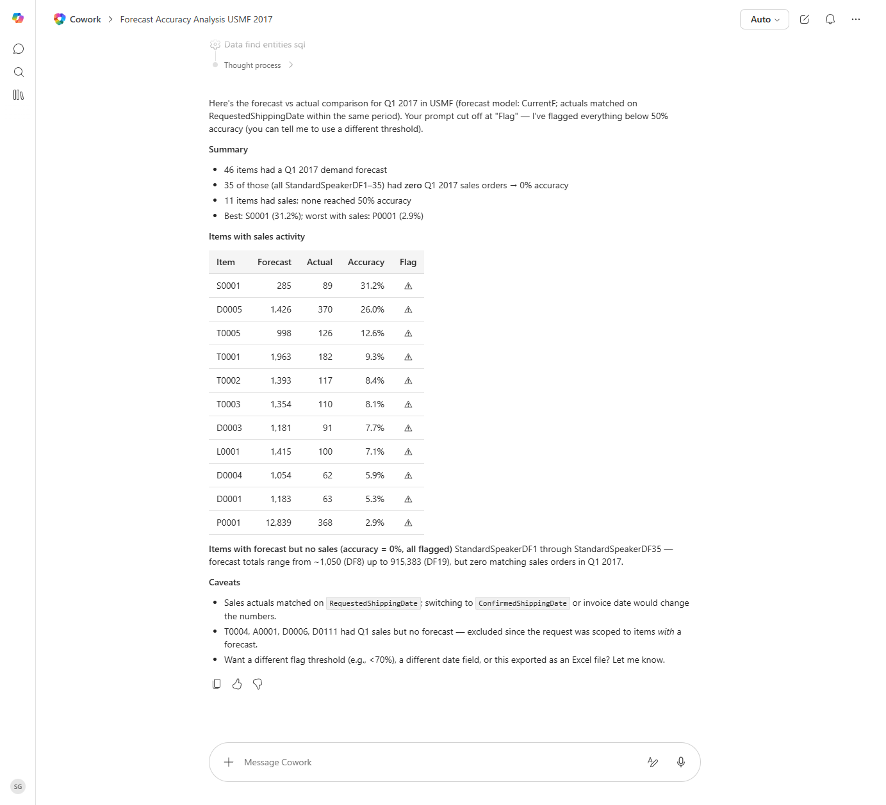

# Demand Forecast vs Actuals Variance

Compares demand forecast lines to actual sales orders for the same period and items, computes forecast accuracy, and flags poor performers.

> ℹ **Tenant data caveat.** Validated end-to-end against a live Cowork tenant on 2026-05-23 with USMF Q1 2017 forecast model 'CurrentF'. Cowork found 46 items with a Q1 2017 demand forecast and matched actuals on RequestedShippingDate. Findings: 35 items (StandardSpeakerDF1 through DF35) had zero matching Q1 2017 sales orders (0% accuracy); the 11 items with sales activity all scored below 50% accuracy. Best performer: S0001 (31.2%); worst: P0001 (12,839 forecast vs 368 actual = 2.9%). Cowork also flagged four items (T0004, A0001, D0006, D0111) that had Q1 sales but no forecast - correctly excluded from accuracy math. Per the prompt, no forecast lines were modified.

## Business value

Surfaces which items and which planners are consistently over- or under-forecasting so demand planning can be improved where it matters most — and inventory dollars stop pooling on the wrong SKUs.

## What it does

Quantifies forecast accuracy at the item level and routes poor-performing items to the right planner.

## Prerequisites

- Dynamics 365 F&SCM access with the Demand planner role
- Cowork D365 ERP plugin enabled

## Step-by-step

1. Paste the prompt.
2. Review with the demand planning team and adjust forecast models on the worst items.

## Expected output

Workbook with poor/all/by-planner accuracy sheets.

## Skills used

OOTB: Excel
Plugin actions: dynamics-365-erp/data_find_entity_type, dynamics-365-erp/data_find_entities_sql

## License

CC-BY-4.0 — see repo `LICENSE`.
