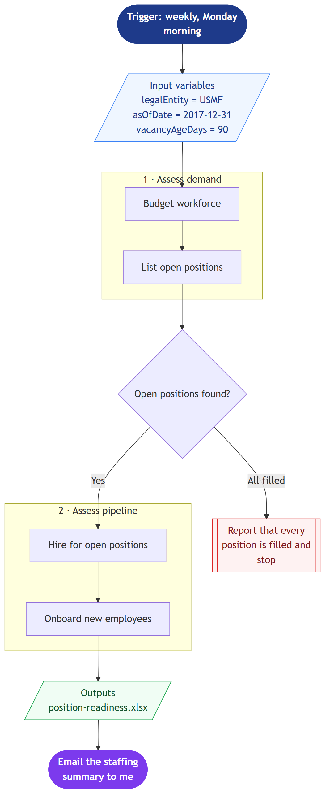

# Open Position & Onboarding Readiness Blueprint

Paste this recruit-and-onboard workflow blueprint into Cowork and it reports which positions are vacant, how long they have been open, and which new hires lack onboarding records.

> ⚠ **Draft recipe — not yet verified.** The blueprint below is generated from the Business Process Catalog but has not been run against a live Cowork tenant. Validate before relying on it.

## Business value

Gives HR and the hiring managers one weekly view of where the pipeline is stalled, so long-vacant roles get escalated instead of quietly ageing.

## How to run it

1. Open a new Cowork task and turn the **Dynamics 365 ERP** plugin toggle on.
2. Paste the blueprint image below into the message.
3. Paste the prompt from `prompt.md` into the **same** message.
4. Send. Cowork reads the diagram for structure and the prompt for values.

## Blueprint

Mermaid source: [`blueprint.mmd`](blueprint.mmd)

## Process phases

1. **Assess demand** — Budget workforce, List open positions
2. **Assess pipeline** — Hire for open positions, Onboard new employees

Derived from the Microsoft Business Process Catalog area **Recruit and onboard talent** (`hire-to-retire/recruit-and-onboard-talent`) — [Microsoft Learn](https://learn.microsoft.com/en-us/dynamics365/guidance/business-processes/hire-to-retire-plan-recruit-workforce-overview).

## Input bindings

| Variable | Value | Meaning |
| --- | --- | --- |
| `legalEntity` | USMF | Legal entity to scope every query to. |
| `asOfDate` | 2017-12-31 | Reporting date. USMF HR data centres on FY2017. |
| `vacancyAgeDays` | 90 | Days a position may stay open before it is flagged as stale. |

## Guardrails

- Read only. Do not create or modify positions, workers, or onboarding checklists.
- Produce the workbook in this run — do not return a plan or a methodology document instead.
- Do not include compensation figures or any other sensitive personal data in the output.

## Expected output

One workbook plus an email draft listing vacancies ranked by days open. USMF has 97 active workers; if the position hierarchy is sparse, expect a partial report naming what was readable.

## Prerequisites

- Dynamics 365 F&SCM access with the Human resources role
- Cowork D365 ERP plugin toggled on in the session

## Skills used

OOTB: Excel, Email

Plugin actions: dynamics-365-erp/data_find_entity_type, dynamics-365-erp/data_find_entities_sql

## License

CC-BY-4.0 — see repo `LICENSE`.
