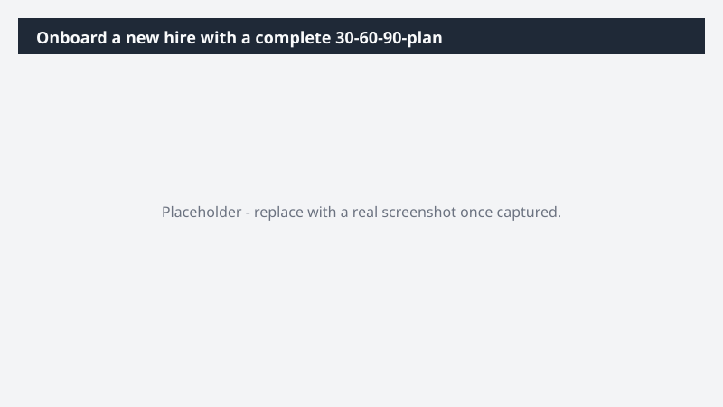

# Onboard a new hire with a complete 30-60-90-plan

Set a new hire up to succeed from day one - without building the plan from scratch.

> ⚠ **Draft recipe — not yet verified.** This prompt is reproduced from the Microsoft Copilot Cowork Task Pack for All Functions. It has not been run against our tenant, so the output described below is the pack's stated expectation rather than an observed result. Validate before relying on it.

## Business value

Set a new hire up to succeed from day one - without building the plan from scratch. A Word 30-60-90-day onboarding plan, an interactive "Getting started" HTML dashboard, and recurring check-ins scheduled with the new hire across their first month.

## What it does

A Word 30-60-90-day onboarding plan, an interactive "Getting started" HTML dashboard, and recurring check-ins scheduled with the new hire across their first month.

## Prerequisites

- Microsoft 365 Copilot licence with access to Cowork

## Step-by-step

1. Open Cowork and start a new task.
2. Paste the prompt from `prompt.md`, replacing anything in square brackets with your own values.
3. Review the plan Cowork proposes before letting it run.
4. Check any drafted email or calendar change before approving it — the prompt holds them for review rather than sending.

## How Cowork works through it

1. [Folder] → Read job description, charter, stakeholders, SharePoint
2. Synthesize → Map role responsibilities + team priorities
3. Word → 30-60-90 plan with role-specific weekly deliverables
4. Build → Interactive "Getting Started" HTML dashboard
5. Calendar → Review availability, schedule twice-weekly check-ins
6. Deliver → Plan, dashboard, and check-ins in place

## Expected output

A Word 30-60-90-day onboarding plan, an interactive "Getting started" HTML dashboard, and recurring check-ins scheduled with the new hire across their first month.

## Source

Adapted from the **Microsoft Copilot Cowork Task Pack for All Functions**, a task pack Microsoft publishes for customers. The prompt is reproduced as published; the surrounding recipe metadata, process tagging, and guidance are the Cookbook's.

## Skills used

OOTB: Word, Calendar Management, Scheduling, Communications, Enterprise Search

Plugin: none required

## License

CC-BY-4.0 — see repo `LICENSE`.
