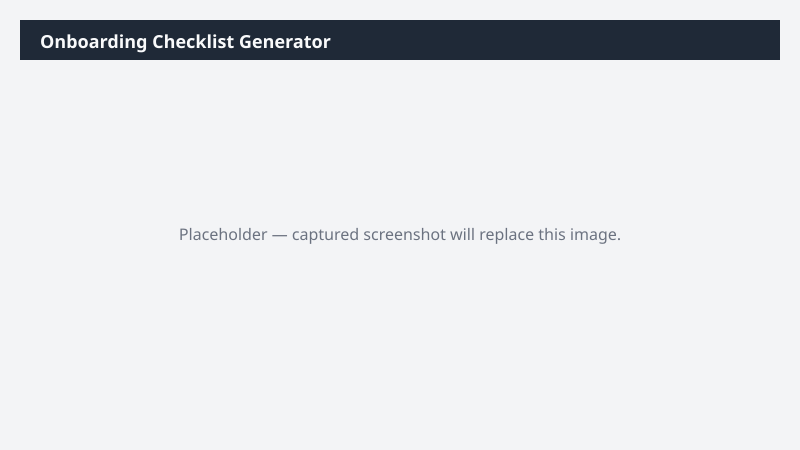

# Onboarding Checklist Generator

Generates a role-tailored onboarding checklist as a Word document for a named new hire.

## What it does

Produces a tailored onboarding plan and a welcome-email draft.

## Prerequisites

- No D365 dependency

## Step-by-step

1. Paste the prompt and provide the new-hire details when asked.
2. Review and personalize before sending.

## Expected output

One Word document and one email draft.

## Skills used

OOTB: Word, Email
Plugin actions: —

## License

CC-BY-4.0 — see repo `LICENSE`.
