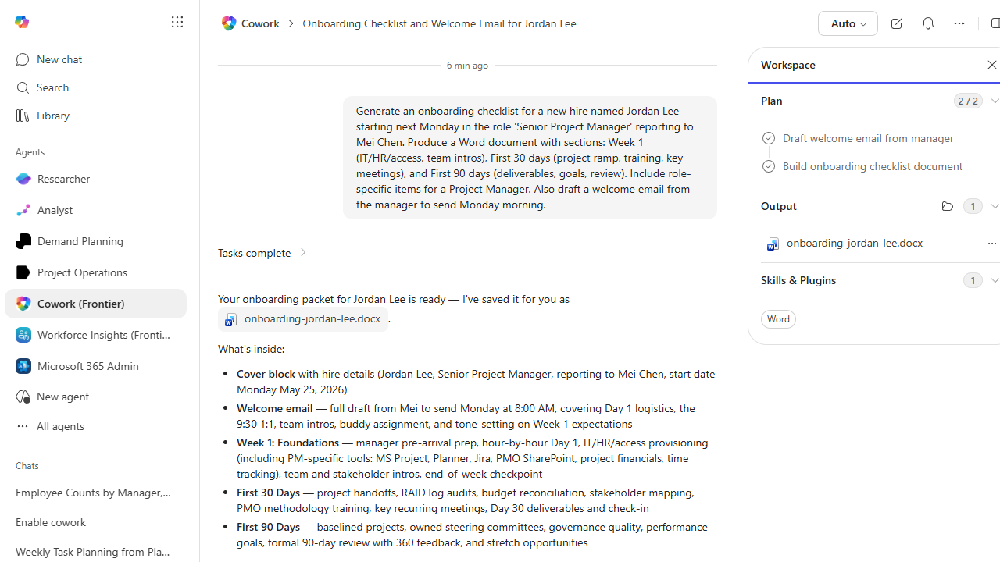

# Onboarding Checklist Generator

Generates a role-tailored onboarding checklist as a Word document for a named new hire.

> ℹ **Tenant data caveat.** Validated end-to-end against a live Cowork tenant on 2026-05-23. Generated onboarding-jordan-lee.docx for a hypothetical Senior Project Manager (Jordan Lee, reporting to Mei Chen, start Mon May 25 2026) with sections for cover block, welcome email draft, Week 1 Foundations (manager pre-arrival, hour-by-hour Day 1, IT/HR/access provisioning including PM-specific tools: MS Project, Planner, Jira, PMO SharePoint, project financials, time tracking), First 30 Days (project handoffs, RAID log audits, budget reconciliation, stakeholder mapping, PMO methodology training, Day 30 deliverables), and First 90 Days (baselined projects, owned steering committees, 360 review, stretch opportunities). Every item uses a checkbox so it works on paper or screen.

## Business value

Cuts hours of HR busywork per new hire and makes sure no role-specific access, equipment, or compliance step gets missed.

## What it does

Produces a tailored onboarding plan and a welcome-email draft.

## Prerequisites

- No D365 dependency

## Step-by-step

1. Paste the prompt and provide the new-hire details when asked.
2. Review and personalize before sending.

## Expected output

One Word document and one email draft.

## Skills used

OOTB: Word, Email
Plugin actions: —

## License

CC-BY-4.0 — see repo `LICENSE`.
