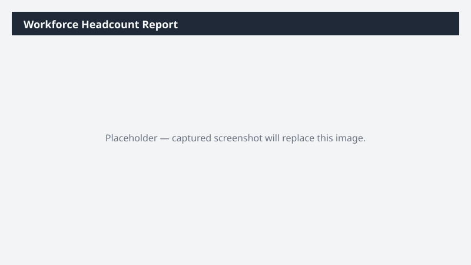

# Workforce Headcount Report

Builds a headcount report by department, location, and worker type for the current period.

> ⚠ **Draft recipe — not yet verified.** The prompt, OOTB skill list, and plugin actions named below are starter content. No one has run this against a live Cowork tenant with the Dynamics 365 ERP plugin yet. Plugin action ids may not match Microsoft's actual published surface. Validate before relying on it.

## What it does

HR snapshot of current headcount with year-over-year trend.

## Prerequisites

- Read access to the configured HR data source via Cowork

## Step-by-step

1. Paste the prompt.
2. Validate the trend figures with HR.

## Expected output

Workbook with headcount by dimension and YoY trend.

## Skills used

OOTB: Excel
Plugin actions: —

## License

CC-BY-4.0 — see repo `LICENSE`.
