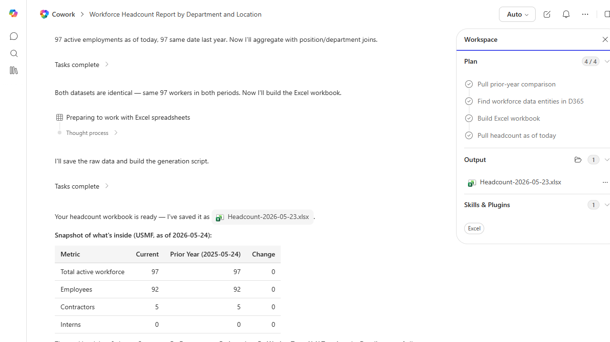

# Workforce Headcount Report

Builds a headcount report by department, location, and worker type for the current period.

> ℹ **Tenant data caveat.** Validated end-to-end against a live Cowork tenant on 2026-05-23 with USMF. Cowork pulled 97 active workers (92 employees + 5 contractors + 0 interns) and produced Headcount-2026-05-23.xlsx with 6 sheets: Summary, By Department, By Location, By Worker Type, YoY Trend, and Detail (full roster of all 97). Honesty notes surfaced by the agent: (a) D365's worker type enum only has Employee/Contractor - the Intern row in the summary is structurally zero, not an empirical zero; (b) YoY change is zero because the demo source shows the same 97 personnel records active on both 2026-05-24 and 2025-05-24; (c) 9 recent hires (personnel #000763-000771) are unassigned department/position and roll up under 'Unassigned'.

## Business value

Gives HR and finance a unified headcount source-of-truth that reconciles to payroll without spreadsheet stitching.

## What it does

HR snapshot of current headcount with year-over-year trend.

## Prerequisites

- Read access to the configured HR data source via Cowork

## Step-by-step

1. Paste the prompt.
2. Validate the trend figures with HR.

## Expected output

Workbook with headcount by dimension and YoY trend.

## Skills used

OOTB: Excel
Plugin actions: —

## License

CC-BY-4.0 — see repo `LICENSE`.
