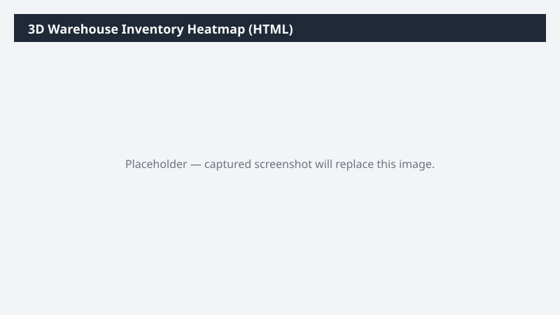

# 3D Warehouse Inventory Heatmap (HTML)

Generates a self-contained 3D HTML visualization of warehouse bins colored by fill percentage or inventory value, navigable in any browser.

> ⚠ **Draft recipe — not yet verified.** The prompt, OOTB skill list, and plugin actions named below are starter content. No one has run this against a live Cowork tenant with the Dynamics 365 ERP plugin yet. Validate before relying on it.

## Business value

Turns the warehouse on-hand snapshot into a spatial picture so ops can see at a glance where slow-movers are blocking prime pick locations and where capacity is genuinely full vs just disorganized.

## What it does

Renders an interactive 3D warehouse view in a single HTML file — opens in any browser, no D365 access needed by the viewer.

## Prerequisites

- Dynamics 365 F&SCM access with the Warehouse manager role
- Cowork D365 ERP plugin enabled

## Step-by-step

1. Paste the prompt and confirm the warehouse when asked.
2. Open the HTML in your browser and orbit/pan to inspect bins.
3. Share via Teams to the warehouse leads.

## Expected output

One standalone interactive 3D HTML file.

## Skills used

OOTB: PDF
Plugin actions: dynamics-365-erp/data_find_entity_type, dynamics-365-erp/data_find_entities_sql

## License

CC-BY-4.0 — see repo `LICENSE`.
