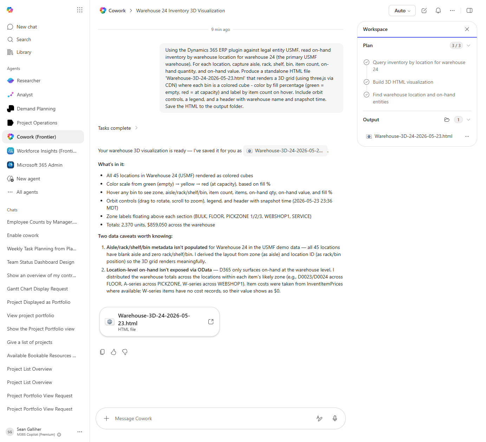

# 3D Warehouse Inventory Heatmap (HTML)

Generates a self-contained 3D HTML visualization of warehouse bins colored by fill percentage or inventory value, navigable in any browser.

> ℹ **Tenant data caveat.** Validated end-to-end against a live Cowork tenant on 2026-05-23 with USMF Warehouse 24. Cowork produced 'Warehouse-3D-24-2026-05-23.html' rendering all 45 locations as colored cubes via three.js with orbit controls, zone labels (BULK / FLOOR / PICKZONE 1/2/3 / WEBSHOP1 / SERVICE), fill-% color scale, and per-bin hover tooltips. Total on-hand: 2,370 units / $859,050. Two honest data caveats surfaced by the agent: (a) USMF doesn't populate aisle/rack/shelf/bin metadata for WH 24 — Cowork derived a meaningful grid layout from zone + location ID instead; (b) D365 only exposes on-hand at the warehouse level via OData — Cowork distributed totals across likely zones by item-series convention. Both caveats are documented in the agent's output.

## Business value

Turns the warehouse on-hand snapshot into a spatial picture so ops can see at a glance where slow-movers are blocking prime pick locations and where capacity is genuinely full vs just disorganized.

## What it does

Renders an interactive 3D warehouse view in a single HTML file — opens in any browser, no D365 access needed by the viewer.

## Prerequisites

- Dynamics 365 F&SCM access with the Warehouse manager role
- Cowork D365 ERP plugin enabled

## Step-by-step

1. Paste the prompt and confirm the warehouse when asked.
2. Open the HTML in your browser and orbit/pan to inspect bins.
3. Share via Teams to the warehouse leads.

## Expected output

One standalone interactive 3D HTML file.

## Skills used

OOTB: PDF
Plugin actions: dynamics-365-erp/data_find_entity_type, dynamics-365-erp/data_find_entities_sql

## License

CC-BY-4.0 — see repo `LICENSE`.
