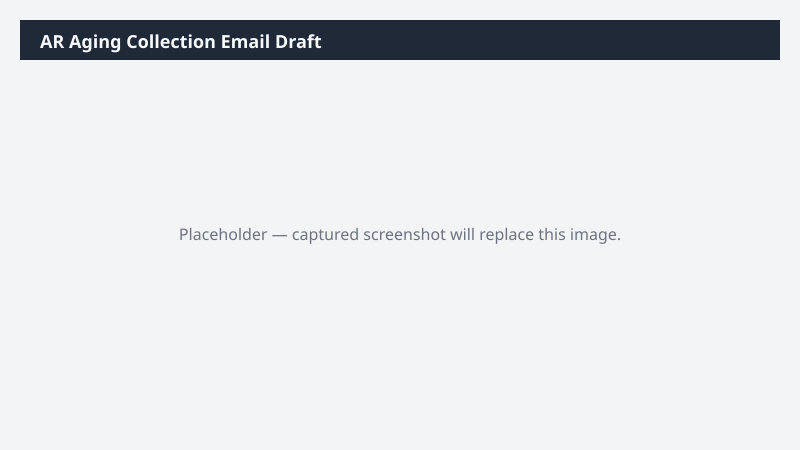

# AR Aging Collection Email Draft

Drafts polite-but-firm collection emails to customers with overdue invoices, grouped by severity bucket.

## What it does

Generates per-customer collection emails as drafts, varying tone by aging bucket.

## Prerequisites

- Dynamics 365 F&SCM access with the Credit/collections role

## Step-by-step

1. Paste the prompt.
2. Open each draft, review tone, and personalize before sending.

## Expected output

One email draft per overdue customer.

## Skills used

OOTB: Email, Communications
Plugin actions: dynamics-365-erp/ar-aging-query

## License

CC-BY-4.0 — see repo `LICENSE`.
