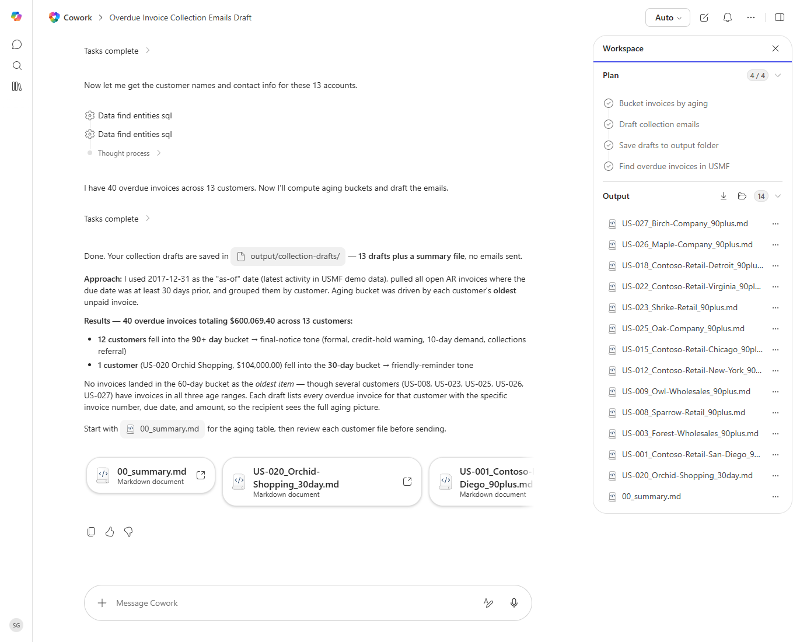

# AR Aging Collection Email Draft

Drafts polite-but-firm collection emails to customers with overdue invoices, grouped by severity bucket.

> ℹ **Tenant data caveat.** Validated end-to-end against a live Cowork tenant on 2026-05-23 with USMF. Cowork used 2017-12-31 as the as-of date (since USMF demo activity ends in 2017), pulled all open AR invoices >=30 days overdue, and produced 13 per-customer collection drafts plus a summary file covering 40 overdue invoices totalling $600,069.40 across 13 customers. Tone correctly varied by aging bucket - 12 final-notice (90+) drafts and 1 friendly-reminder (30-day). All drafts saved to output/collection-drafts/; no emails were sent.

## Business value

Multiplies the collections team - every overdue customer gets a personalized, tone-appropriate nudge without anyone hand-writing emails.

## What it does

Generates per-customer collection emails as drafts, varying tone by aging bucket.

## Prerequisites

- Dynamics 365 F&SCM access with the Credit/collections role

## Step-by-step

1. Paste the prompt.
2. Open each draft, review tone, and personalize before sending.

## Expected output

One email draft per overdue customer.

## Skills used

OOTB: Email, Communications
Plugin actions: dynamics-365-erp/data_find_entity_type, dynamics-365-erp/data_find_entities_sql

## License

CC-BY-4.0 — see repo `LICENSE`.
