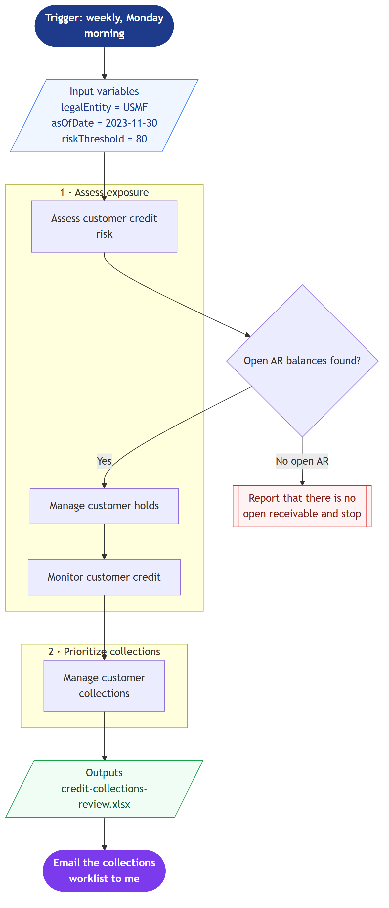
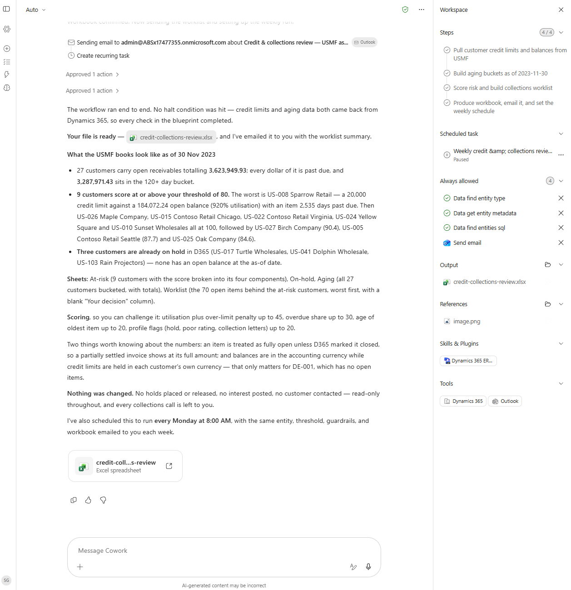

# Credit & Collections Review Blueprint

Paste this credit-and-collections workflow blueprint into Cowork and it ranks customers by credit exposure and overdue balance, then proposes a collections worklist.

> ℹ **Tenant data caveat.** Validated end-to-end against a live Cowork tenant on 2026-08-20 with USMF demo data. Cowork read the blueprint image and ran all four phases with ZERO clarifying questions — every input was bound by the prompt. The 'Open AR balances found?' gateway passed, so no halt node was reached, and it produced 'credit-collections-review.xlsx' with At-risk, On-hold, Aging, and Worklist sheets. Findings: 27 customers carry 3,623,949.93 in open receivables, all of it past due, with 3,287,971.43 sitting in the 120+ day bucket; 9 customers scored at or above the riskThreshold of 80, the worst being US-008 Sparrow Retail at 920% credit utilisation with an item 2,535 days past due; 3 customers already on hold had no open balance as of the as-of date. Cowork surfaced two data caveats unprompted: an item counts as fully open unless D365 marked it closed, so a partially settled invoice shows at full value; and balances are in accounting currency while credit limits are held per-customer, which only affects DE-001 (no open items). The read-only guardrails held — no holds placed or released, no interest posted, no customer contacted. Notably, Cowork converted the diagram's trigger node into a genuine recurring scheduled task (weekly, Monday 08:00), created in a paused state, and required explicit approval before sending the email and before creating that schedule.

## Business value

Points the collections team at the handful of accounts carrying real exposure instead of working the aging report top to bottom, which shortens days sales outstanding.

## How to run it

1. Open a new Cowork task and turn the **Dynamics 365 ERP** plugin toggle on.
2. Paste the blueprint image below into the message.
3. Paste the prompt from `prompt.md` into the **same** message.
4. Send. Cowork reads the diagram for structure and the prompt for values.

Cowork asked **0** clarifying questions during verification.

## Blueprint

Mermaid source: [`blueprint.mmd`](blueprint.mmd)

## Process phases

1. **Assess exposure** — Assess customer credit risk, Manage customer holds, Monitor customer credit
2. **Prioritize collections** — Manage customer collections

Derived from the Microsoft Business Process Catalog area **Manage credit and collections** (`order-to-cash/manage-credit-and-collections`) — [Microsoft Learn](https://learn.microsoft.com/en-us/dynamics365/guidance/business-processes/order-to-cash-monitor-customer-credit-collections-overview).

## Input bindings

| Variable | Value | Meaning |
| --- | --- | --- |
| `legalEntity` | USMF | Legal entity to scope every query to. |
| `asOfDate` | 2023-11-30 | Aging as-of date. USMF customer AR runs through 2023-11-29. |
| `riskThreshold` | 80 | Percent of credit limit consumed that flags a customer as at-risk. |

## Guardrails

- Read only. Do not place or release credit holds, do not post interest, do not contact customers.
- Produce the workbook in this run — do not return a plan or a methodology document instead.
- Rank and recommend; leave every collections decision to me.

## Expected output

One workbook in `Documents/Cowork/output/` with At-risk, On-hold, Aging, and Worklist sheets, plus an emailed summary. Cowork also turns the trigger node into a real recurring scheduled task, which it creates paused for you to enable.

## Prerequisites

- Dynamics 365 F&SCM access with the Accounts receivable role
- Cowork D365 ERP plugin toggled on in the session

## Skills used

OOTB: Excel, Email

Plugin actions: dynamics-365-erp/data_find_entity_type, dynamics-365-erp/data_find_entities_sql

## License

CC-BY-4.0 — see repo `LICENSE`.
