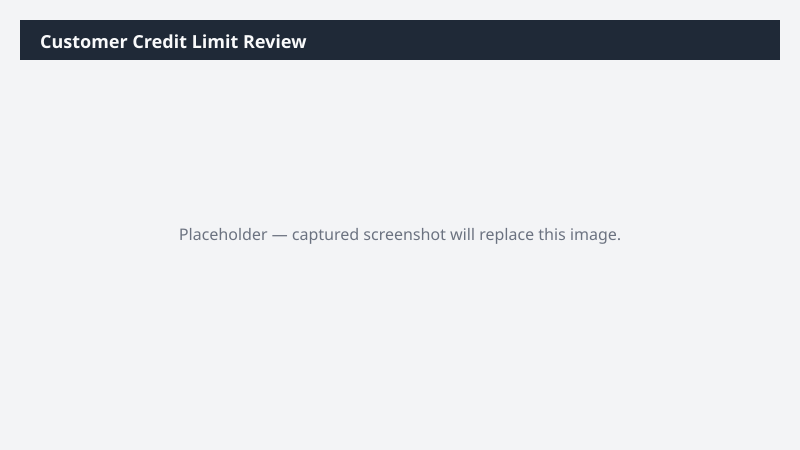

# Customer Credit Limit Review

Builds a review report of customers whose credit limit or exposure looks out of policy.

> ⚠ **Draft recipe — not yet verified.** The prompt, OOTB skill list, and plugin actions named below are starter content. No one has run this against a live Cowork tenant with the Dynamics 365 ERP plugin yet. Validate before relying on it.

## Business value

Protects DSO and reduces bad-debt write-offs by flagging customers who have drifted out of credit policy before the next big order ships.

## What it does

Highlights credit-policy issues so the credit team can act.

## Prerequisites

- Dynamics 365 F&SCM access with the Credit/collections role

## Step-by-step

1. Paste the prompt.
2. Review the report; update limits via D365 with the credit committee.

## Expected output

Workbook with categorized customer credit issues.

## Skills used

OOTB: Excel
Plugin actions: dynamics-365-erp/data_find_entity_type, dynamics-365-erp/data_find_entities_sql

## License

CC-BY-4.0 — see repo `LICENSE`.
