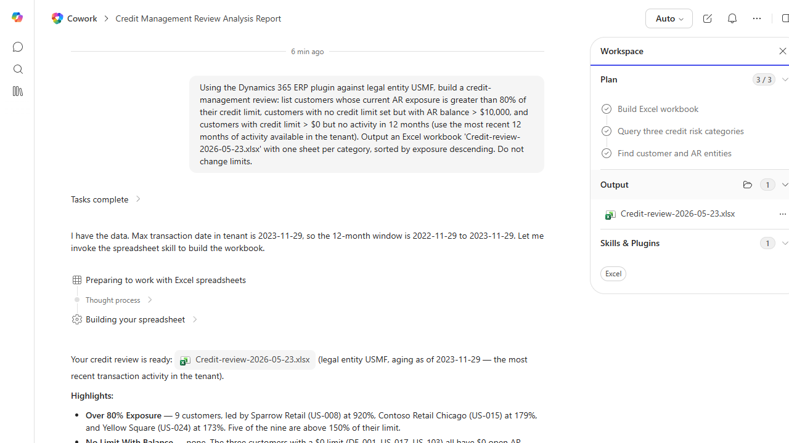

# Customer Credit Limit Review

Builds a review report of customers whose credit limit or exposure looks out of policy.

> ℹ **Tenant data caveat.** Validated end-to-end against a live Cowork tenant on 2026-05-23 with USMF. Cowork found that the tenant's most recent transaction is 2023-11-29 and built a 12-month window ending there. Real findings: 9 customers over 80% exposure (Sparrow Retail US-008 at 920%, Contoso Retail Chicago US-015 at 179%, Yellow Square US-024 at 173%; 5 of 9 above 150%); 0 customers with no-limit-but-balance (3 customers have $0 limit all with $0 open AR); 11 customers carrying credit lines with no activity in the 12-month window. Real workbook Credit-review-2026-05-23.xlsx with one sheet per category sorted by exposure descending plus a Notes sheet documenting methodology and the CustomersV3 / CustTransactions entities used. No credit limits modified.

## Business value

Protects DSO and reduces bad-debt write-offs by flagging customers who have drifted out of credit policy before the next big order ships.

## What it does

Highlights credit-policy issues so the credit team can act.

## Prerequisites

- Dynamics 365 F&SCM access with the Credit/collections role

## Step-by-step

1. Paste the prompt.
2. Review the report; update limits via D365 with the credit committee.

## Expected output

Workbook with categorized customer credit issues.

## Skills used

OOTB: Excel
Plugin actions: dynamics-365-erp/data_find_entity_type, dynamics-365-erp/data_find_entities_sql

## License

CC-BY-4.0 — see repo `LICENSE`.
