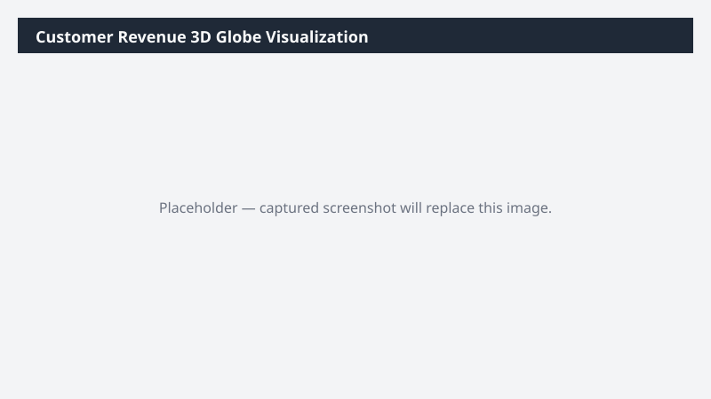

# Customer Revenue 3D Globe Visualization

Builds an interactive 3D globe HTML visualization plotting customer locations sized by trailing-12-month revenue.

## What it does

Visualizes customer revenue on a 3D globe as a standalone HTML file.

## Prerequisites

- Dynamics 365 F&SCM read access

## Step-by-step

1. Paste the prompt.
2. Open the saved HTML file in your browser to explore.

## Expected output

One standalone interactive HTML file.

## Skills used

OOTB: PDF
Plugin actions: dynamics-365-erp/sales-order-query

## License

CC-BY-4.0 — see repo `LICENSE`.
